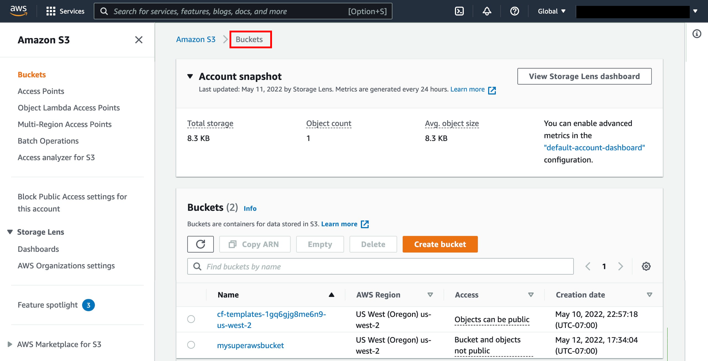
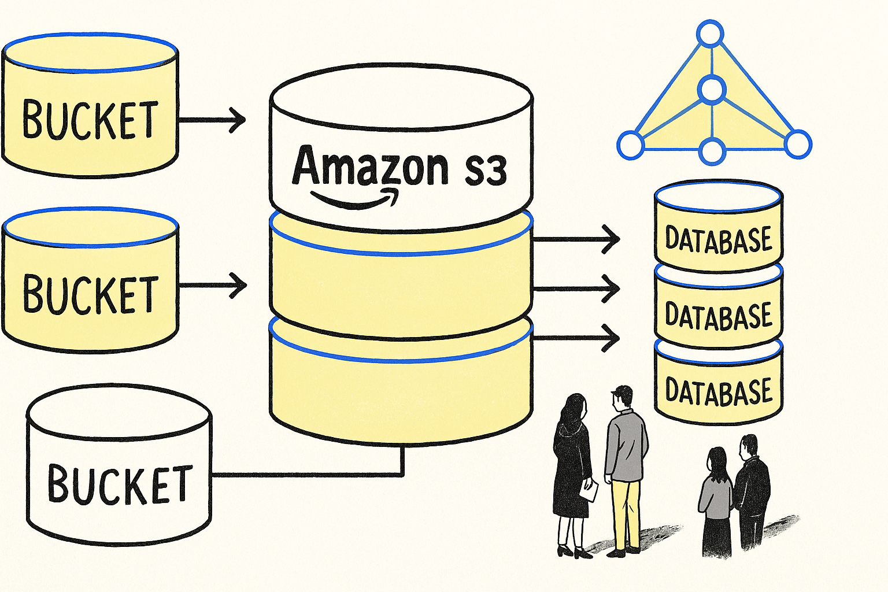
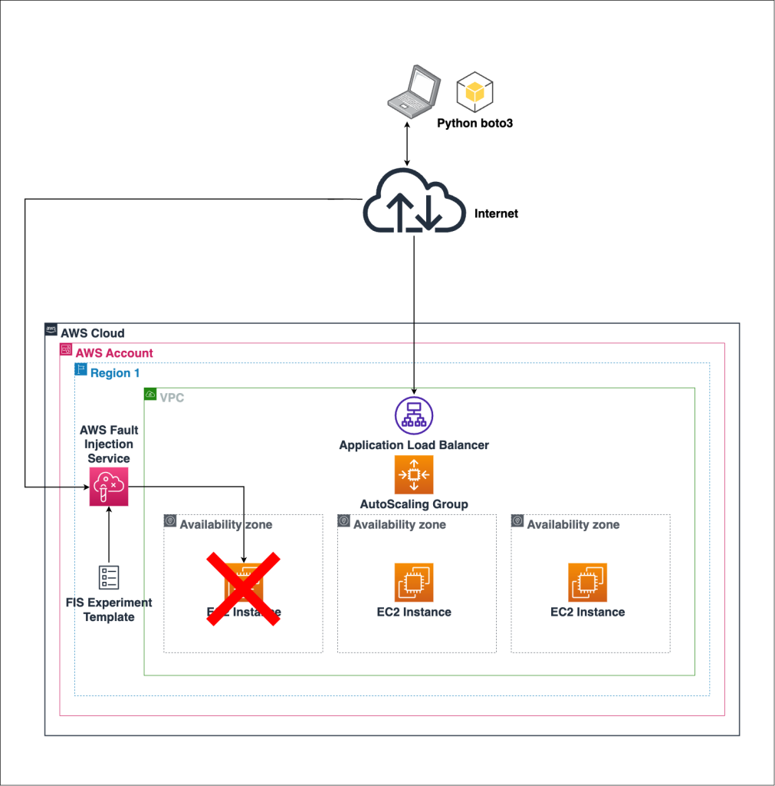
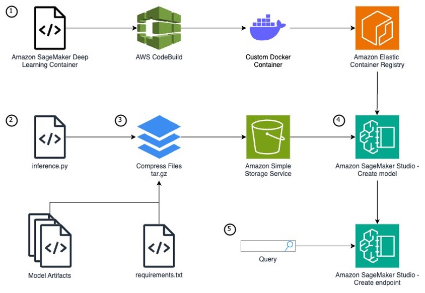

## Welcome to Cloud for Data Scinece/Analytics/Engineering

**Amazon Web Services (AWS) for Data Science**

1️⃣ What is AWS?
Definition

Amazon Web Services (AWS) is a cloud computing platform by Amazon that provides scalable infrastructure and services over the internet.

Instead of buying physical servers, you can:
Rent virtual machines
Store data
Deploy applications
Build ML models
All on-demand.

2️⃣ Why AWS for Data Science?

Traditional Setup Problem : 

Buy servers

Configure networking

Maintain hardware

Scale manually

High upfront cost

AWS Solution

No hardware
Instant server creation

Auto scaling

Pay only for usage

Managed ML services

3️⃣ Core AWS Concepts

☁️ 3.1 Cloud Computing
Definition:

Delivering computing services over the internet.

Types:

IaaS – Infrastructure as a Service (EC2)
PaaS – Platform as a Service (Elastic Beanstalk)
SaaS – Software as a Service (Gmail, Zoom)

🌍 3.2 Regions & Availability Zones

A Region is a geographic area where AWS has data centers.
Example: Mumbai (ap-south-1), US-East (Virginia).

Each Region contains multiple Availability Zones (AZs).

Why this matters:

If one data center fails → other AZ works.

Used for high availability.

Critical for production systems.

**4️⃣ AWS Storage Services**

4.1 Amazon S3 (Simple Storage Service)

Definition:

Object storage service used to store files.

Key Concepts:
Bucket → Folder
Object → File
Unlimited storage
Highly durable (99.999999999%)

Use Cases:

Store CSV datasets
Store ML models
Store backups
Host static websites

💾 4.2 EBS (Elastic Block Store)
Definition:

Block storage attached to EC2.
Works like Hard Disk
Used for OS, database storage
Persistent storage

🧊 4.3 Glacier
Definition:

Low-cost storage for archives.
Cheap
Slow retrieval
Used for backups

5️⃣ AWS Compute Services
🖥 5.1 EC2 (Elastic Compute Cloud)

Definition:

EC2 instances come in different types:

General Purpose → t2, t3 (small apps, freelancing)

Compute Optimized → c5 (ML training)

Memory Optimized → r5 (big datasets)

GPU → p3, g4 (Deep learning)

You choose instance type based on:

RAM requirement

CPU cores

GPU need

Budget

You can:

Install Python
Install MySQL
Run ML models
Host applications

Key Components:

AMI (Amazon Machine Image) → OS template
Instance Type → CPU/RAM configuration
Key Pair → SSH access
Security Group → Firewall

EC2 for Data Science:

Create Ubuntu server
Install Anaconda
Connect via SSH
Run Jupyter Notebook

⚡ 5.2 AWS Lambda
Definition:

Serverless compute service.

No server management
Event-driven
Pay per execution

Used for:

Triggering pipeline jobs
Automating workflows

6️⃣ Networking Basics

🌐 6.1 VPC (Virtual Private Cloud)

Definition:

Create public servers (accessible from internet)

Create private servers (internal only)

Control IP ranges

Secure databases

Example:

EC2 in public subnet

RDS in private subnet

You control:

IP ranges

Subnets

Routing

Security

🔐 Security Group

Acts as:

Firewall for EC2

Controls:

Inbound traffic
Outbound traffic

Example:
Allow port 22 for SSH
Allow port 8888 for Jupyter

7️⃣ AWS CLI
Definition:

Command Line Interface to control AWS from terminal.

Example:
aws s3 ls
aws ec2 describe-instances

Used for:

Automation

DevOps

CI/CD

8️⃣ Application Deployment in AWS
Deployment Methods:
1️⃣ Manual EC2 Deployment

Launch EC2

Install software
Upload code
Run app

2️⃣ Elastic Beanstalk

Upload code
AWS manages infrastructure

3️⃣ Docker + EC2

Container-based deployment

9️⃣ AWS SageMaker (For Machine Learning)

Definition:

SageMaker is a fully managed ML platform.

It removes the need to:

Launch EC2 manually

Configure GPUs

Install ML libraries

It provides:

Notebook environment

Built-in algorithms

Distributed training

One-click deployment

Model monitoring

You can:

Build models
Train models
Deploy models
Monitor models

SageMaker Workflow

Upload data to S3
Create Notebook instance
Train model
Deploy endpoint

Use API for predictions

Why SageMaker?

No server setup

Auto scaling

Built-in algorithms

Production ready

🔟 IAM (Identity and Access Management)
Definition:

IAM controls access inside AWS.

Components:

User → Person

Role → Permission set assigned to service

Policy → JSON document defining allowed actions

Example:

Give EC2 permission to read S3

Restrict intern from deleting resources

You can:

Create users
Assign roles
Attach policies

Important for:

Security
Controlled access

1️⃣1️⃣ Databases in AWS
RDS (Relational Database Service)
Definition:

Managed SQL database.

Supports:

MySQL
PostgreSQL
MariaDB

No need to manage:

Backups
Scaling
Patching

1️⃣2️⃣ Data Science Architecture (Beginner Level)

Example Workflow:

Store raw data → S3
Launch EC2
Connect to S3
Train model
Save model in S3

Deploy via EC2 or SageMaker

1️⃣3️⃣ Pay-As-You-Go Model

AWS charges based on:

Compute hours
Storage used
Data transfer
API calls

No upfront cost.

1️⃣4️⃣ When to Use What?
Requirement	Service
Store datasets	S3
Run Python code	EC2
Serverless automation	Lambda
Train ML models easily	SageMaker
SQL database	RDS
Archive data	Glacier

1️⃣5️⃣ Advantages of AWS

Scalable
Reliable
Secure
Global infrastructure
Large ecosystem
Free Tier available

1️⃣6️⃣ AWS for Freelancers (Your Use Case)

Since you:

Work with small data
Do freelance analytics
Use MySQL + Python

Best setup:

Store data → S3
Compute → Small EC2 (t2.micro / t3.micro)
Database → RDS MySQL
Deployment → EC2 or Elastic Beanstalk

Cost can be very low if optimized.

🚀 Final Summary

AWS provides:

Storage (S3)
Compute (EC2, Lambda)
ML Platform (SageMaker)
Databases (RDS)
Networking (VPC)
Security (IAM)

It allows data scientists to:

Build
Train
Deploy
Scale

Without managing physical infrastructure.

✅ PART 2 — AWS Products with Normal Equivalent

This is what you asked clearly 👍

## AWS Products and Their Normal Equivalent

| AWS Product        | Category            | What It Is                              | Normal Equivalent (Traditional Setup) |
|--------------------|--------------------|------------------------------------------|----------------------------------------|
| EC2                | Compute             | Virtual machine in cloud                | Physical server / Your laptop         |
| S3                 | Object Storage      | Stores files (objects)                  | Google Drive / External storage       |
| EBS                | Block Storage       | Hard disk attached to EC2               | Internal HDD / SSD                    |
| RDS                | Relational Database | Managed SQL database                    | MySQL installed on server             |
| DynamoDB           | NoSQL Database      | Managed NoSQL database                  | MongoDB                               |
| Redshift           | Data Warehouse      | Analytical database for BI & reporting  | Snowflake / On-prem Data Warehouse    |
| Athena             | Query Engine        | Query S3 using SQL                      | Presto / Querying CSV locally         |
| Glue               | ETL Service         | Data pipeline & transformation service  | Talend / Manual Python ETL scripts    |
| SageMaker          | ML Platform         | Build, train & deploy ML models         | Jupyter + Flask + Manual deployment   |
| Lambda             | Serverless Compute  | Run code without managing servers       | Cron job / Background script          |
| Elastic Beanstalk  | PaaS                | Easy application deployment             | Heroku                                |
| VPC                | Networking          | Private network inside AWS              | Office LAN network                    |

## Database vs Data Warehouse vs Data Lake

| Feature            | Database (OLTP)        | Data Warehouse (OLAP)     | Data Lake                    |
|--------------------|------------------------|----------------------------|------------------------------|
| Main Purpose       | Daily transactions     | Business analytics         | Store raw data               |
| Data Type          | Structured             | Structured                 | Structured + Unstructured    |
| Example AWS        | RDS / DynamoDB         | Redshift                   | S3                           |
| Query Type         | Simple queries         | Complex analytical queries | Process after storing        |
| Schema             | Schema-on-write        | Schema-on-write            | Schema-on-read               |
| Data Volume        | Medium                 | Large                      | Very Large                   |
| Users              | Application systems    | Analysts / BI tools        | Data Engineers / Scientists  |
| Cost               | Moderate               | Higher                     | Cheapest storage             |