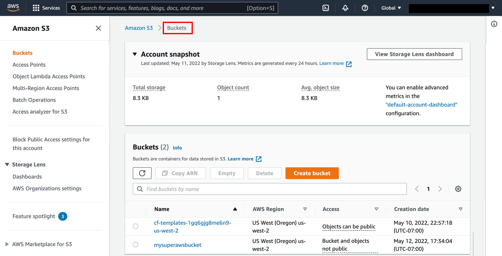
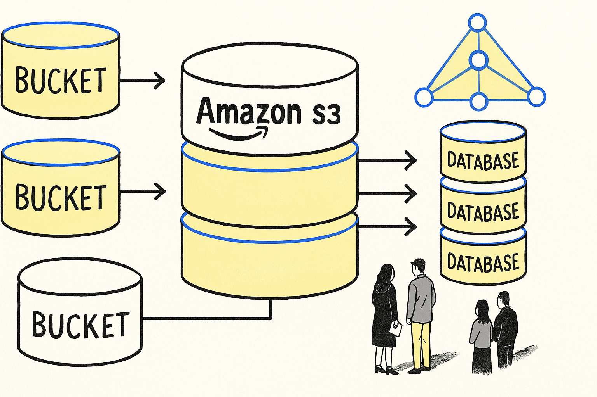
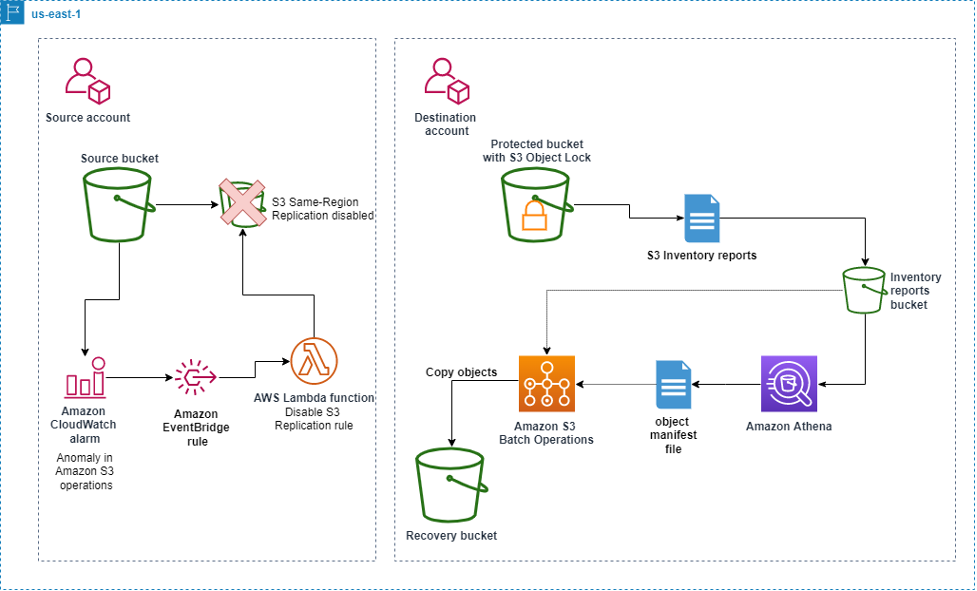
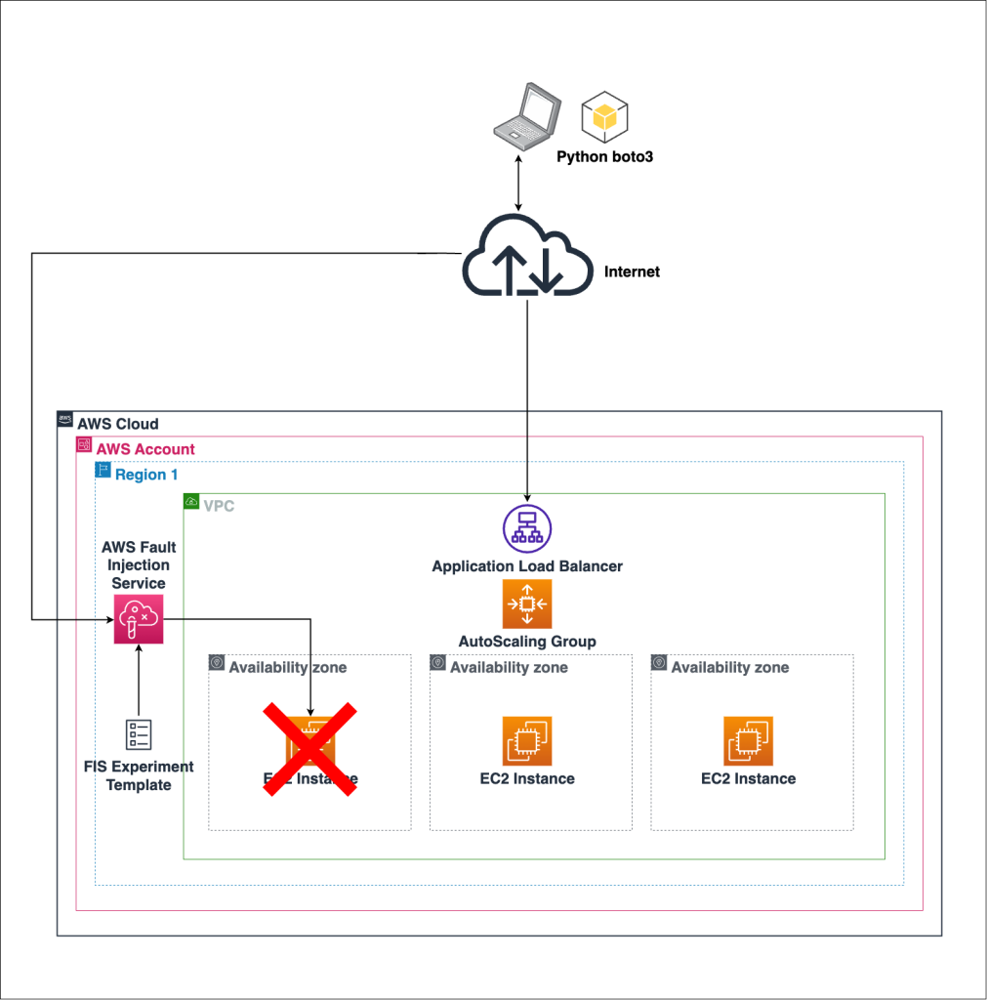
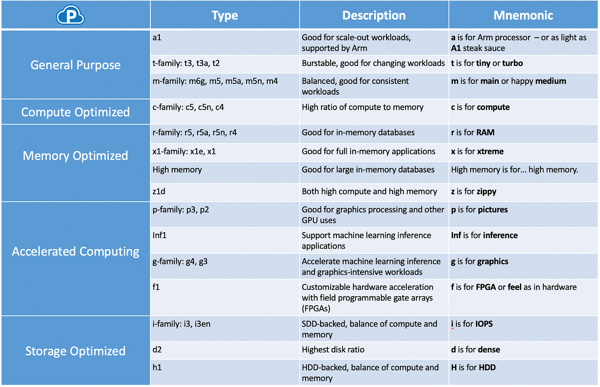
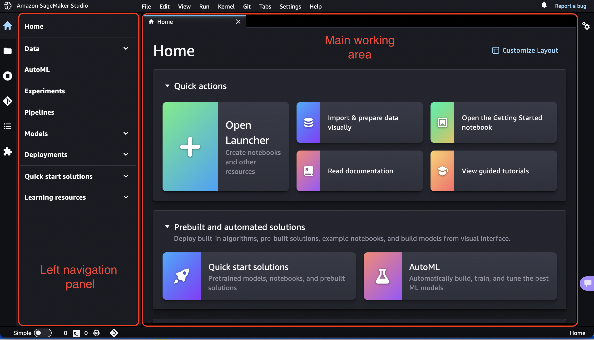
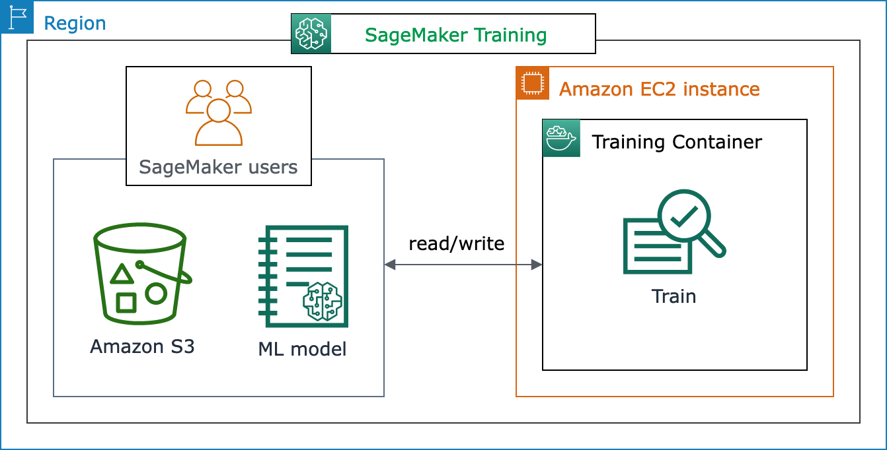
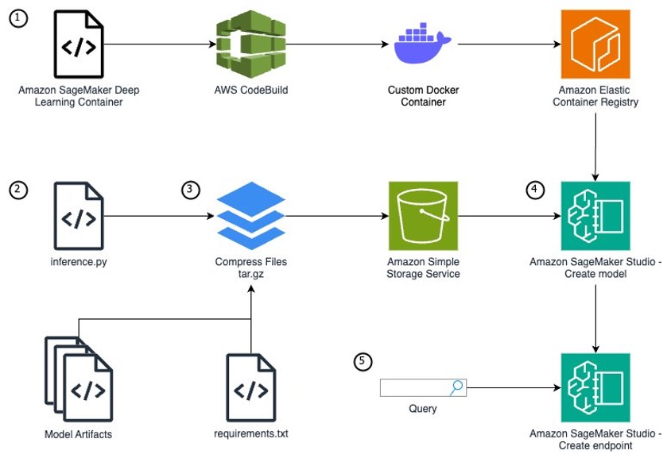

<div class="aws-hero">
  <div class="aws-chip">Cloud | Data Engineering | Analytics</div>
  <h1>AWS for Data Science, Analytics, and Engineering</h1>
  <p>
    Amazon Web Services (AWS) is one of the most widely used cloud platforms for building data pipelines,
    storing data, training machine learning models, and running analytics workloads.
  </p>
</div>

## 1.1 What Is AWS? { .aws-h2 }

AWS is a cloud computing platform by Amazon that provides scalable infrastructure and services over the internet.

Instead of buying physical servers, you can use AWS to:

- Rent virtual machines
- Store files and datasets
- Build and deploy applications
- Create data pipelines
- Train and serve ML models

Everything is available on demand, and you usually pay only for what you use.

## 1.2 Why AWS Is Useful for Data Work { .aws-h2 }

### 1.2.1 Traditional Setup Problems { .aws-h3 }

Without cloud platforms, a company often needs to:

- Buy servers
- Configure networking
- Maintain hardware
- Scale manually
- Spend large money upfront

### 1.2.2 AWS Solution { .aws-h3 }

AWS solves this by offering:

- No physical hardware to manage
- Instant server creation
- On-demand storage
- Auto scaling
- Managed databases
- Managed machine learning services
- Pay-as-you-go pricing

### 1.2.3 Simple Example { .aws-h3 }

If you want to analyze a 50 GB dataset:

- Traditional way: buy a machine, install software, manage storage, and hope it is enough
- AWS way: upload data to S3, launch compute when needed, run analysis, and shut it down after use

## 1.3 Core Cloud Concepts { .aws-h2 }

### 1.3.1 Cloud Computing { .aws-h3 }

Cloud computing means delivering computing services over the internet.

Main service models:

- IaaS (Infrastructure as a Service): you manage the machine and software
  Example: EC2
- PaaS (Platform as a Service): the platform helps you deploy applications faster
  Example: Elastic Beanstalk
- SaaS (Software as a Service): ready-made software used through the internet
  Example: Gmail, Zoom

### 1.3.2 Regions and Availability Zones { .aws-h3 }

A Region is a geographic area where AWS has data centers.

Examples:

- Mumbai: `ap-south-1`
- US East (N. Virginia): `us-east-1`

Each Region contains multiple Availability Zones (AZs).

Why this matters:

- If one data center fails, another AZ can still work
- It improves reliability and high availability
- It is important for production systems

### 1.3.3 Shared Responsibility Model { .aws-h3 }

In AWS, security is shared between AWS and the customer.

AWS is responsible for:

- Physical data centers
- Hardware
- Core cloud infrastructure

You are responsible for:

- User permissions
- Application security
- Data protection
- Secure configuration of services

This is very important in real projects.

## 1.4 AWS Storage Services { .aws-h2 }

Storage is one of the most important parts of any data architecture.

### 1.4.1 Amazon S3 { .aws-h3 }

Amazon S3 (Simple Storage Service) is an object storage service used to store files.





Key concepts:

- Bucket: top-level storage container
- Object: actual file stored in a bucket
- Key: full path or name of the object

Why S3 is popular:

- Highly durable
- Very scalable
- Low-cost compared to traditional storage
- Integrates with almost every AWS analytics service

Common use cases:

- Store CSV, JSON, and Parquet files
- Store raw and processed datasets
- Store backups
- Store ML models
- Data lake storage
- Static website hosting

Simple example:

You receive sales data every day. You can store files like:

```text
s3://company-data/raw/sales/2026/04/19/sales.csv
```

### 1.4.2 EBS { .aws-h3 }

Amazon EBS (Elastic Block Store) is block storage attached to EC2 instances.

Think of it like a hard disk for a virtual machine.

Used for:

- Operating system storage
- Installed software
- Databases running on EC2
- Persistent application storage

### 1.4.3 Glacier { .aws-h3 }

Amazon S3 Glacier is low-cost archival storage.

Best for:

- Old backups
- Compliance archives
- Rarely accessed data

Important tradeoff:

- Cheap storage
- Slow retrieval compared to regular S3

## 1.5 AWS Compute Services { .aws-h2 }

Compute services are used to run code, applications, data pipelines, and models.

### 1.5.1 EC2 { .aws-h3 }

Amazon EC2 (Elastic Compute Cloud) provides virtual machines in the cloud.




You can use EC2 to:

- Install Python
- Install MySQL or PostgreSQL
- Run Jupyter Notebook
- Build APIs
- Train smaller ML models
- Host applications

Key components:

- AMI (Amazon Machine Image): OS template
- Instance Type: CPU, RAM, and GPU configuration
- Key Pair: secure login access
- Security Group: firewall rules
- EBS Volume: attached storage

Common EC2 instance families:

- General purpose: `t2`, `t3`, `t4g`
- Compute optimized: `c5`, `c6i`
- Memory optimized: `r5`, `r6i`
- GPU instances: `p3`, `g4`, `g5`

How to choose an instance:

- More RAM for large data processing
- More CPU for heavy computation
- GPU for deep learning
- Smaller instance for practice and light workloads

Example for data science:

1. Launch Ubuntu EC2
2. Install Python and required packages
3. Connect through SSH
4. Pull data from S3
5. Run model training
6. Save outputs back to S3

### 1.5.2 AWS Lambda { .aws-h3 }

AWS Lambda is a serverless compute service.

It lets you run code without managing servers.

You write a function, choose a runtime such as Python or Node.js, connect an event source, and AWS runs the function only when it is triggered.

Main benefits:

- No server management
- Event-driven execution
- Auto scaling
- Pay per execution

Important ideas:

- Function: the code that runs
- Runtime: the language environment, such as Python
- Handler: the entry point AWS Lambda calls
- Event: input data passed to the function
- Context: runtime information about the function execution
- Trigger: the AWS service or schedule that starts the function
- Execution role: IAM role that gives the function permission to access AWS services

Common use cases:

- Trigger ETL jobs
- Process files uploaded to S3
- Send notifications
- Run lightweight automation
- Call APIs
- Clean or transform small files
- Start Glue jobs, Step Functions workflows, or other AWS services

Simple example:

When a CSV file is uploaded to S3, a Lambda function can automatically validate it or trigger a downstream pipeline.

Example Lambda flow:

1. User uploads `sales.csv` to S3
2. S3 sends an event to Lambda
3. Lambda reads file metadata
4. Lambda checks file format
5. Lambda starts a Glue ETL job
6. Processed data is stored back in S3

Simple Python handler:

```python
def lambda_handler(event, context):
    bucket_name = event["Records"][0]["s3"]["bucket"]["name"]
    file_name = event["Records"][0]["s3"]["object"]["key"]

    print(f"New file uploaded: {bucket_name}/{file_name}")

    return {
        "statusCode": 200,
        "message": "File processed successfully"
    }
```

Common Lambda triggers:

| Trigger | Example |
|---|---|
| S3 | Run when a file is uploaded |
| API Gateway | Run when an API endpoint is called |
| EventBridge | Run on a schedule |
| DynamoDB Streams | Run when table data changes |
| SQS | Process messages from a queue |

When Lambda is a good choice:

- Task is event-driven
- Code runs for a short time
- Workload changes frequently
- You do not want to manage servers
- Automation is lightweight

When Lambda is not ideal:

- Long-running jobs
- Very large data processing
- Applications that need full server control
- Heavy machine learning training

Important limits to remember:

- Lambda functions have a maximum execution time
- Memory and CPU are configured together
- Temporary storage is limited
- Cold starts can add delay when a function starts after being idle

For data engineering, Lambda is often used as a connector or trigger, not as the main engine for large processing.

### 1.5.3 Elastic Beanstalk { .aws-h3 }

Elastic Beanstalk is a platform service for deploying applications easily.

You upload code, and AWS manages much of the infrastructure for you.

Useful for:

- Simple web apps
- Beginner deployments
- Teams that want less infrastructure management

## 1.6 Networking Basics { .aws-h2 }

### 1.6.1 VPC { .aws-h3 }

Amazon VPC (Virtual Private Cloud) is your private network inside AWS.

It lets you:

- Create public and private subnets
- Control IP ranges
- Configure routing
- Secure internal systems

Typical setup:

- EC2 in a public subnet
- Database in a private subnet

### 1.6.2 Security Groups { .aws-h3 }

Security Groups act like firewalls for AWS resources such as EC2.

They control:

- Inbound traffic
- Outbound traffic

Examples:

- Allow port `22` for SSH
- Allow port `8888` for Jupyter
- Allow port `80` or `443` for web traffic

### 1.6.3 Public vs Private Subnet { .aws-h3 }

- Public subnet: resources can access or be accessed through the internet
- Private subnet: resources are internal and more secure

A common best practice is:

- Keep application servers in public subnet if needed
- Keep databases in private subnet

## 1.7 Security and Access Management { .aws-h2 }

### 1.7.1 IAM { .aws-h3 }

IAM (Identity and Access Management) controls access inside AWS.

Core components:

- User: a person or application identity
- Role: temporary permission set used by AWS services or users
- Policy: JSON document that defines allowed or denied actions

Examples:

- Give EC2 permission to read files from S3
- Restrict an intern from deleting resources
- Allow a data engineer to use Glue and Athena but not IAM admin actions

Why IAM matters:

- Security
- Controlled access
- Least privilege principle
- Auditability

### 1.7.2 Least Privilege { .aws-h3 }

Least privilege means giving only the minimum permissions required to do a task.

This is one of the most important AWS security principles.

## 1.8 AWS CLI { .aws-h2 }

AWS CLI is the command-line interface used to control AWS services from the terminal.

Examples:

```bash
aws s3 ls
aws ec2 describe-instances
aws iam list-users
```

Used for:

- Automation
- DevOps workflows
- CI/CD pipelines
- Quick checks from terminal

## 1.9 Databases in AWS { .aws-h2 }

### 1.9.1 RDS { .aws-h3 }

Amazon RDS (Relational Database Service) is a managed SQL database service.

Supported engines include:

- MySQL
- PostgreSQL
- MariaDB
- SQL Server
- Oracle

AWS helps with:

- Backups
- Patching
- Monitoring
- High availability options

Use RDS when you need:

- Application databases
- Transactional systems
- Structured data with SQL

### 1.9.2 DynamoDB { .aws-h3 }

DynamoDB is a managed NoSQL database service.

Good for:

- Very high-scale applications
- Key-value data
- Low-latency workloads

Example use cases:

- User sessions
- Event data
- Shopping cart systems

## 1.10 Analytics and Data Engineering Services { .aws-h2 }

These services are especially important for data engineering and analytics roles.

### 1.10.1 AWS Glue { .aws-h3 }

AWS Glue is a managed ETL and data integration service.

Used for:

- Crawling datasets
- Creating metadata catalogs
- Running ETL jobs
- Preparing data for analytics

Why it matters:

- Reduces manual ETL setup
- Integrates with S3, Athena, and Redshift

Simple example:

Raw CSV files arrive in S3. Glue can crawl them, infer schema, and create metadata for querying.

### 1.10.2 Amazon Athena { .aws-h3 }

Athena is a serverless query service that lets you run SQL directly on data stored in S3.

Best for:

- Quick analysis
- Ad hoc querying
- Exploring CSV, JSON, and Parquet files

Example:

You can query a file in S3 without loading it into a database first.

```sql
SELECT customer_id, SUM(amount)
FROM sales_data
GROUP BY customer_id;
```

### 1.10.3 Amazon Redshift { .aws-h3 }

Redshift is AWS's data warehouse service for analytical workloads.

Best for:

- BI reporting
- Large analytical queries
- Enterprise dashboards

Use Redshift when:

- Your data volume is large
- You need fast SQL analytics
- BI teams query structured datasets frequently

### 1.10.4 AWS Lake Formation { .aws-h3 }

Lake Formation helps build, secure, and manage data lakes in AWS.

It is useful for:

- Centralized governance
- Permissions on lake data
- Easier data lake setup

## 1.11 AWS SageMaker { .aws-h2 }

Amazon SageMaker is a fully managed machine learning platform.





It reduces the need to:

- Launch EC2 manually
- Configure GPU machines yourself
- Install everything from scratch

It provides:

- Notebook environment
- Built-in algorithms
- Training jobs
- Hyperparameter tuning
- One-click deployment
- Model monitoring

You can use SageMaker to:

- Build models
- Train models
- Deploy models
- Monitor models

### 1.11.1 Typical SageMaker Workflow { .aws-h3 }

1. Upload data to S3
2. Create a notebook or training job
3. Train the model
4. Evaluate results
5. Deploy an endpoint
6. Use API calls for predictions

### 1.11.2 Why SageMaker Is Useful { .aws-h3 }

- No server setup
- Managed infrastructure
- Auto scaling options
- Production-friendly deployment
- Better workflow for ML teams

## 1.12 Application Deployment in AWS { .aws-h2 }

Common deployment methods:

### 1.12.1 Manual EC2 Deployment { .aws-h3 }

Steps:

1. Launch EC2
2. Install software
3. Upload code
4. Run application

Best for:

- Learning
- Small projects
- Full control

### 1.12.2 Elastic Beanstalk Deployment { .aws-h3 }

Steps:

1. Upload code
2. AWS provisions infrastructure
3. Application is deployed

Best for:

- Faster deployment
- Less infrastructure work

### 1.12.3 Docker on EC2 { .aws-h3 }

This is container-based deployment.

Useful when:

- You want environment consistency
- The app has multiple dependencies
- You want easier portability

## 1.13 Beginner Data Science Architecture on AWS { .aws-h2 }

### 1.13.1 Simple Workflow { .aws-h3 }

Example beginner workflow:

1. Store raw data in S3
2. Launch EC2 or use SageMaker
3. Read data from S3
4. Clean and transform data
5. Train model
6. Save model back to S3
7. Deploy with EC2, Lambda, or SageMaker endpoint

### 1.13.2 Analytics Workflow Example { .aws-h3 }

Example data engineering flow:

1. Source system sends files to S3
2. Glue crawls and catalogs the data
3. Athena is used for quick SQL analysis
4. Cleaned data is loaded into Redshift
5. BI tools query Redshift for dashboards

### 1.13.3 Real-Life Example { .aws-h3 }

Suppose you work for an e-commerce company:

- Customer clickstream data lands in S3
- Glue prepares metadata and ETL
- Athena helps analysts explore the raw data
- Redshift stores curated reporting tables
- SageMaker trains a recommendation model

This is a very common modern cloud data flow.

## 1.14 Pay-As-You-Go Model { .aws-h2 }

AWS generally charges based on actual usage.

Typical billing factors:

- Compute hours
- Storage used
- Data transfer
- Number of requests
- API calls

This means:

- Low starting cost
- Good flexibility
- But poor cost monitoring can become expensive

## 1.15 When to Use What { .aws-h2 }

| Requirement | AWS Service |
|-------------|-------------|
| Store datasets and files | S3 |
| Run Python code on a server | EC2 |
| Lightweight serverless automation | Lambda |
| Train ML models easily | SageMaker |
| Managed SQL database | RDS |
| Archive old data | Glacier |
| Query files in S3 using SQL | Athena |
| Build ETL pipelines | Glue |
| Analytical data warehouse | Redshift |
| Manage access and permissions | IAM |

## 1.16 Advantages of AWS { .aws-h2 }

- Scalable
- Reliable
- Secure
- Global infrastructure
- Large ecosystem
- Free Tier available for learning
- Strong support for analytics and machine learning

## 1.17 AWS Products and Their Normal Equivalent { .aws-h2 }

| AWS Product | Category | What It Is | Normal Equivalent |
|-------------|----------|------------|-------------------|
| EC2 | Compute | Virtual machine in cloud | Physical server or your laptop |
| S3 | Object Storage | Stores files as objects | Google Drive or external storage |
| EBS | Block Storage | Hard disk attached to EC2 | Internal HDD or SSD |
| RDS | Relational Database | Managed SQL database | MySQL installed on a server |
| DynamoDB | NoSQL Database | Managed NoSQL database | MongoDB |
| Redshift | Data Warehouse | Analytical database for BI and reporting | Snowflake or on-prem warehouse |
| Athena | Query Engine | Query S3 using SQL | Presto or local SQL on files |
| Glue | ETL Service | Data pipeline and transformation service | Talend or Python ETL scripts |
| SageMaker | ML Platform | Build, train, and deploy ML models | Jupyter plus manual deployment |
| Lambda | Serverless Compute | Run code without managing servers | Cron job or background script |
| Elastic Beanstalk | PaaS | Easy application deployment | Heroku |
| VPC | Networking | Private network inside AWS | Office LAN network |

## 1.18 Database vs Data Warehouse vs Data Lake { .aws-h2 }

| Feature | Database (OLTP) | Data Warehouse (OLAP) | Data Lake |
|---------|------------------|------------------------|-----------|
| Main Purpose | Daily transactions | Business analytics | Store raw data |
| Data Type | Structured | Structured | Structured + Unstructured |
| Example AWS Service | RDS / DynamoDB | Redshift | S3 |
| Query Type | Simple queries | Complex analytical queries | Process after storing |
| Schema | Schema-on-write | Schema-on-write | Schema-on-read |
| Data Volume | Medium | Large | Very large |
| Users | Application systems | Analysts and BI tools | Data engineers and scientists |
| Cost | Moderate | Higher | Cheapest storage |

## 1.19 Quick Revision Notes { .aws-h2 }

- S3 is the most important base storage service in AWS data projects
- EC2 is used when you want full control over a server
- Lambda is used for lightweight event-driven automation
- RDS is for managed relational databases
- Glue is for ETL and metadata cataloging
- Athena is for querying S3 using SQL
- Redshift is for data warehouse analytics
- SageMaker is for managed machine learning workflows
- IAM controls who can access what
- VPC and Security Groups are core networking concepts

## 1.20 Final Summary { .aws-h2 }

AWS provides:

- Storage: S3, EBS, Glacier
- Compute: EC2, Lambda
- Databases: RDS, DynamoDB
- Data engineering and analytics: Glue, Athena, Redshift
- Machine learning: SageMaker
- Networking: VPC
- Security: IAM

For data roles, AWS is valuable because it lets you:

- Store massive datasets
- Run scalable processing
- Build pipelines
- Query data efficiently
- Train and deploy ML models
- Manage everything in one cloud ecosystem
