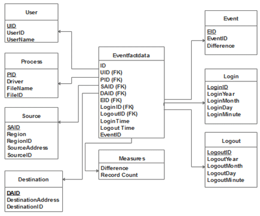
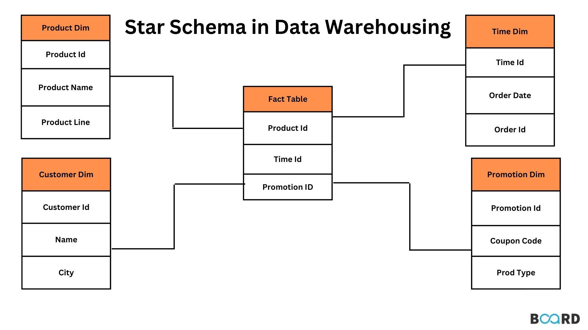

# 1️⃣ Introduction

📘 **What is Databricks?**

Databricks is a cloud-based unified data and AI platform built on top of Apache Spark that enables organizations to process, analyze, and build machine learning solutions on large-scale data.

It is designed around the Lakehouse architecture, which combines:

Data Lake capabilities → Low-cost storage, flexibility, support for structured and unstructured data

Data Warehouse capabilities → High performance, ACID transactions, governance, and BI optimization

This means Databricks gives you the flexibility of a data lake and the reliability of a data warehouse in a single platform.

🚀 **Why Databricks is Called a Managed Service**

Databricks is a managed service, meaning you do not need to manually set up or maintain infrastructure.

Instead of configuring servers, installing Spark, handling failures, and tuning performance — Databricks manages these for you automatically.

**It takes care of:**

Cluster management
Infrastructure provisioning
Scaling
Performance optimization
Security integrations

**This allows**:

Data Engineers → to focus on pipelines

Analysts → to focus on insights

Data Scientists → to focus on models

Instead of spending time on DevOps or infrastructure setup.

1️⃣ Cluster Management

Cluster management refers to the automatic creation, configuration, monitoring, and termination of compute clusters used to process data.

👉 Databricks automatically manages Spark clusters so users don’t need to manually configure servers.

2️⃣ Infrastructure Provisioning

Infrastructure provisioning is the process of setting up cloud resources such as virtual machines, storage, and networking.

👉 Databricks automatically provisions the required cloud infrastructure (AWS, Azure, GCP) when you start a cluster.

3️⃣ Scaling

Scaling is the ability to increase or decrease computing resources based on workload demand.

👉 Databricks supports auto-scaling, meaning it can add or remove worker nodes automatically depending on workload size.

4️⃣ Performance Optimization

Performance optimization involves tuning system resources and execution strategies to run workloads faster and more efficiently.

👉 Databricks optimizes Spark jobs automatically using features like query optimization, caching, and optimized execution engines.

5️⃣ Security Integrations

Security integrations ensure that data access and system usage are secure and compliant with organizational policies.

👉 Databricks integrates with cloud IAM systems, role-based access control, encryption, and Unity Catalog for governance.

💡 In Simple Words 

Without Databricks → You manage servers, install Spark, scale manually, secure everything yourself.

With Databricks → You just write code. The platform manages everything else

This allows data engineers, analysts, and data scientists to focus on building data solutions instead of managing infrastructure.

## Lakehouse architecture workflow diagram

2️⃣ Key Components of Databricks

Workspaces – Collaborative environment for notebooks, jobs, and dashboards

Clusters – Compute resources to run Spark workloads

DBFS (Databricks File System) – Distributed file system abstraction

Delta Lake – Storage layer providing ACID transactions

Unity Catalog – Centralized governance layer

> Competetors of Delta lake are : 
    
    Apache Iceberg, 
    Apache Hudi, 
    Snowflake, 
    Microsoft Fabric (OneLake)

### 🔎 Data Lake vs Data Warehouse vs Lakehouse

| Feature              | Data Lake        | Data Warehouse     | Lakehouse (Databricks) |
|----------------------|------------------|--------------------|-------------------------|
| Storage Cost         | Low              | High               | Low                     |
| Schema               | Flexible         | Structured         | Structured + Flexible   |
| Performance          | Medium           | High               | High                    |
| ACID Support         | ❌ No            | ✅ Yes             | ✅ Yes (Delta Lake)     |
| Governance           | Limited          | Strong             | Strong (Unity Catalog)  |
| Supports ML          | ✅ Yes           | Limited            | ✅ Yes                  |

3️⃣ What is Metadata?

Metadata is “data about data.”

It provides information that describes, explains, or gives context to other data.

Examples of Metadata:

Table name

Column names

Data types

File location

Owner

Created date

Permissions

Metadata helps in:

Data discovery

Governance

Access control

Query optimization

4️⃣ **Managed Tables vs External Tables**

Databricks supports two main types of tables:

🔹 **Managed Tables**

In managed tables, Databricks manages both metadata and physical data storage.

**Characteristics:**

Storage location controlled by Databricks

Dropping table deletes both metadata and data

Strong governance using Unity Catalog

Suitable for fully controlled environments

Multi-tool Access: Difficult

Data Governance: Fully governed

Use Case: Quick analytics, internal BI systems, tightly controlled environments

🔹 **External Tables**

In external tables, Databricks manages only metadata, while data remains in external storage (like S3, ADLS, GCS).

**Characteristics:**

Data stored outside Databricks-managed location

Dropping table removes only metadata

Flexible integration with other tools

Requires governance discipline

Multi-tool Access: Easy

Data Governance: Flexible but requires discipline

Use Case: Shared datasets, existing data lakes, multi-tool ecosystems

### 🔎 Managed vs External Tables

| Feature | Managed Table | External Table |
|----------|----------------|----------------|
| Metadata Management | Databricks | Databricks |
| Data Storage | Managed by Databricks | Stored externally (S3/ADLS/GCS) |
| Data Deletion | Metadata + Data deleted | Only metadata deleted |
| Multi-tool Access | Limited | Easy |
| Governance | Fully controlled | Flexible |
| Best For | Internal analytics | Shared datasets / Existing data lakes |

5️⃣ Lakehouse Architecture

Databricks implements the Lakehouse Architecture, which combines:

Data Lake	Data Warehouse

Cheap storage	High performance

Flexible schema	Structured governance

Raw data storage	BI-ready data

Lakehouse provides:

ACID transactions

Schema enforcement

Time travel

Batch + Streaming support

### 📊 Lakehouse Architecture Overview

6️⃣ 🏗️ Medallion Architecture (Lakehouse Design Pattern)

The Medallion Architecture is a data design pattern used in Databricks to organize data into three layers:

### 🏗️ Medallion architecture and unity catalog overview

🥉 **Bronze Layer – Raw Data**

Ingested data from source systems
Minimal transformation
Used for auditing and traceability

🥈 **Silver Layer – Cleaned & Transformed Data**

Data cleaning
Deduplication
Standardization
Schema enforcement

🥇 **Gold Layer – Business-Level Data**

Aggregated and curated datasets
Business KPIs
Optimized for reporting and analytics

**This layered approach improves:**

Data quality
Maintainability
Performance
Governance

### 📊 Bronze vs Silver vs Gold

| Layer   | Purpose | Data Quality | Transformation Level | Used By |
|----------|----------|--------------|----------------------|----------|
| Bronze   | Raw ingestion | Low | Minimal | Data Engineers |
| Silver   | Cleaned & standardized | Medium | Moderate | Data Engineers / Analysts |
| Gold     | Business-ready data | High | Aggregated & Curated | BI / Business Users |

Source → Bronze → Silver → Gold → BI / ML

7️⃣ Delta Lake

Delta Lake is the storage layer of Databricks that adds reliability to data lakes.

Delta Lake is a open-source storage layer that brings ACID transactions, schema enforcement and time travel capabilities to data lakes.

**It provides:**

ACID transactions

Schema enforcement

Schema evolution

Time travel (versioning)

Scalable metadata handling

Delta Lake solves common data lake problems such as:

Dirty reads

Data corruption

Concurrent write issues

8️⃣ Unity Catalog

Unity Catalog is Databricks’ unified governance solution for data and AI assets.

**It manages:**

Tables

Views

Files

ML models

Permissions

Lineage tracking

**Benefits:**

Centralized access control

Fine-grained permissions (row/column level)

Data lineage tracking

Cross-workspace governance

It ensures secure and compliant data usage across the organization.

9️⃣ ACID Principles

Databricks (via Delta Lake) supports ACID properties:

A – Atomicity
A transaction either fully completes or fully fails.

C – Consistency
Data remains valid before and after a transaction.

I – Isolation
Concurrent transactions do not interfere with each other.

D – Durability
Once committed, data remains stored even if failures occur.

ACID ensures reliability in large-scale data systems.

### 🔒 ACID Properties in Delta Lake

| Property | Meaning | Example |
|----------|----------|----------|
| Atomicity | All or nothing execution | Failed transaction rolls back |
| Consistency | Data remains valid | Constraints enforced |
| Isolation | Transactions do not interfere | Concurrent writes handled safely |
| Durability | Data remains after commit | Data persists after crash |

🔹 OLTP vs OLAP (Very Important for Data Engineers)

OLTP is for running daily business transactions, while OLAP is for analyzing data and generating insights.

Since you're moving towards Data Engineering / Analytics, understanding this clearly is very important.

🟢 What is OLTP?

OLTP = Online Transaction Processing

👉 Used for day-to-day operations
👉 Handles many small transactions

🏦 Example Systems

Amazon (placing an order)

Paytm (making payment)

Bank ATM withdrawal

📌 What Happens in OLTP?

When you:

Add an item to cart

Make payment

Transfer money

Book a ticket

The database:

Inserts data

Updates records

Deletes records

Ensures data consistency

🖼 OLTP Database Structure

✔ Highly normalized tables
✔ Fast inserts & updates
✔ Supports thousands of concurrent users

🔹 Example OLTP Query:

UPDATE orders
SET status = 'Shipped'
WHERE order_id = 101;

Small, fast transaction.

🔵 What is OLAP?

OLAP = Online Analytical Processing

👉 Used for analysis & reporting
👉 Works on large historical data

Used by:

Data Analysts

Data Scientists

Business Intelligence teams

📊 Example Systems

Tableau

Power BI

Snowflake

Databricks

🖼 OLAP Structure (Data Warehouse)

      

✔ Star schema

✔ Fact table + Dimension tables

✔ Aggregations

✔ Historical data

🔹 Example OLAP Query

SELECT region, SUM(sales)
FROM sales_data
GROUP BY region;

This scans millions of rows.

## ⚖ OLTP vs OLAP (Comparison Table)

| Feature        | OLTP (Online Transaction Processing) | OLAP (Online Analytical Processing) |
|---------------|---------------------------------------|--------------------------------------|
| Purpose       | Run business operations               | Analyze business data                |
| Users         | Customers, application users          | Analysts, data scientists            |
| Data          | Current / real-time data              | Historical data                      |
| Queries       | Simple (INSERT, UPDATE, DELETE)       | Complex (aggregations, joins)        |
| Speed         | Milliseconds                          | Seconds / Minutes                    |
| Schema        | Normalized                            | Star / Snowflake schema              |
| Example DB    | MySQL, PostgreSQL                     | Snowflake, BigQuery, Redshift        |

🧠 Simple Real-Life Example

Think of a supermarket:

🛒 Billing counter → OLTP

📊 Monthly sales analysis → OLAP

Since you:

Work in analytics

Want Data Engineer / BI roles

👉 You will mainly work with OLAP systems
👉 But you must understand OLTP to design pipelines

OLTP vs OLAP
Overview

OLTP (Online Transaction Processing) and OLAP (Online Analytical Processing) are two different types of database systems designed for different purposes.

Key Difference:
OLTP is used to run daily business operations.
OLAP is used to analyze data and generate insights.

OLTP (Online Transaction Processing)
Definition

OLTP systems are designed to manage real-time business transactions.
They handle a large number of small, fast operations such as insert, update, and delete.

Characteristics

Highly normalized tables (3NF)

Fast insert/update/delete

Ensures ACID properties

Handles thousands of transactions per second

Small queries

OLTP Architecture (Conceptual View)

OLAP (Online Analytical Processing)
Definition

OLAP systems are designed for complex queries and data analysis.
They work on large volumes of historical data.

Characteristics :

Star or Snowflake schema

Fact and dimension tables

Handles large datasets

Complex aggregations

Read-heavy workload

**Simple Analogy**

Supermarket example:

🛒 Billing counter → OLTP

📊 Monthly sales dashboard → OLAP

Important for Data Engineers

OLTP → Source systems

ETL/ELT → Moves data

OLAP → Data warehouse / Analytics system

Understanding both is critical for designing data pipelines.

>   Hirarchy in Databricks.

Workspace > Catalog > Schema > Tables

🔟 Summary

**Databricks is a modern data platform that:**

Implements Lakehouse architecture

Uses Delta Lake for reliability

Supports Medallion architecture for structured data processing

Provides centralized governance via Unity Catalog

Enables scalable data engineering, analytics, and AI workloads

It simplifies big data processing while maintaining enterprise-grade governance and reliability.