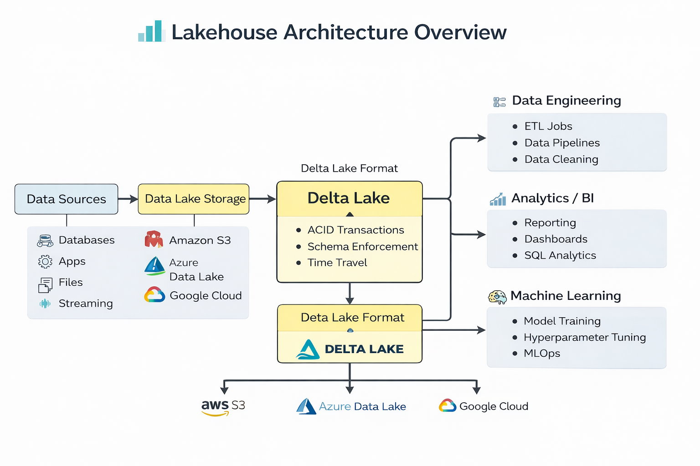
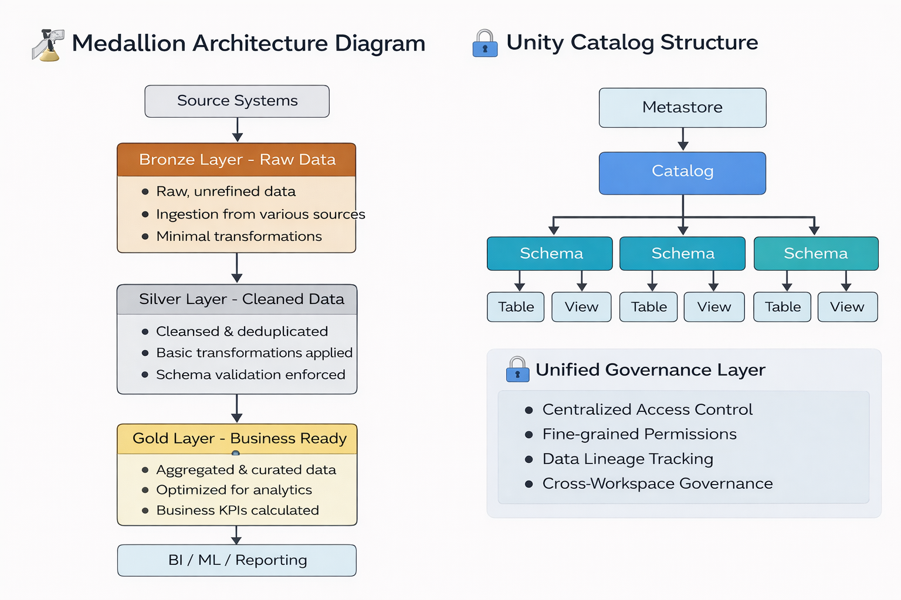
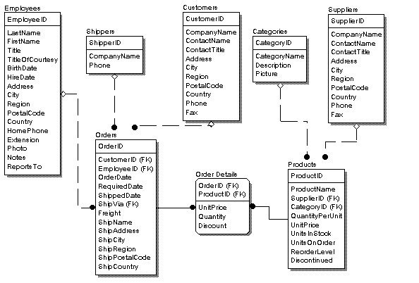
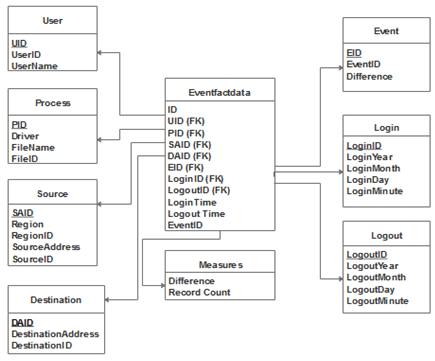
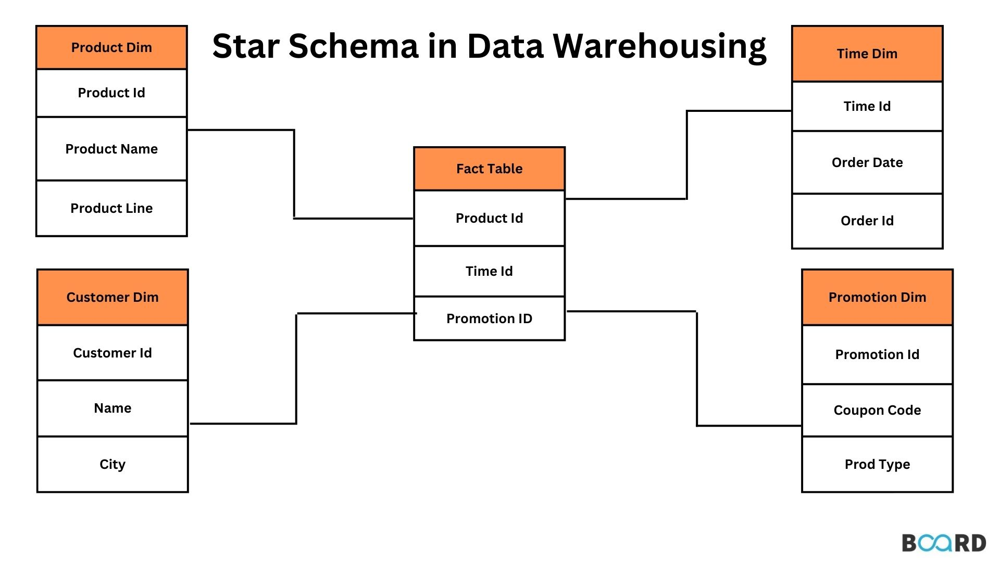

<div class="databricks-hero">
  <div class="databricks-chip">Lakehouse | Spark | Data Platforms</div>
  <h1>Databricks Introduction</h1>
  <p>
    Databricks is a modern unified data and AI platform built around the lakehouse architecture.
    These notes cover the platform from basics to core architecture, governance, storage, and analytics concepts.
  </p>
</div>

## 1.1 What Is Databricks? { .databricks-h2 }

Databricks is a cloud-based unified data and AI platform built on top of Apache Spark that enables organizations to process, analyze, and build machine learning solutions on large-scale data.

It is designed around the Lakehouse architecture, which combines:

- Data Lake capabilities: low-cost storage, flexibility, and support for structured and unstructured data
- Data Warehouse capabilities: high performance, ACID transactions, governance, and BI optimization

This means Databricks gives you the flexibility of a data lake and the reliability of a data warehouse in a single platform.

```text
                    +------------------------------+
                    |        User Personas         |
                    |------------------------------|
                    |  - Data Engineer (DE)        |
                    |    - Jobs and Workflows      |
                    |    - ETL Pipelines           |
                    |                              |
                    |  - Data Analyst (DA)         |
                    |    - SQL Queries             |
                    |    - Dashboards              |
                    |                              |
                    |  - Data Scientist (DS)       |
                    |    - AI and ML Models        |
                    |    - Notebooks               |
                    +------------------------------+
                                ^
                                |
                    +------------------------------+
                    |   Data Intelligence Engine   |
                    |------------------------------|
                    |  Lakehouse + GenAI           |
                    |  - Query Optimization        |
                    |  - AI-powered Insights       |
                    |  - Natural Language to SQL   |
                    +------------------------------+
                                ^
                                |
                    +------------------------------+
                    |        Unity Catalog         |
                    |------------------------------|
                    |  Governance Layer            |
                    |  - Access Control            |
                    |  - Data Lineage              |
                    |  - Audit Logs                |
                    +------------------------------+
                                ^
                                |
                    +------------------------------+
                    |         Delta Lake           |
                    |------------------------------|
                    |  Lakehouse Storage Engine    |
                    |  - ACID Transactions         |
                    |  - Schema Enforcement        |
                    |  - Time Travel               |
                    |  - Batch + Streaming         |
                    +------------------------------+
                                ^
                                |
                    +------------------------------+
                    |            Cloud             |
                    |------------------------------|
                    |  AWS | Azure | GCP           |
                    |  (Compute + Storage)         |
                    +------------------------------+
```

> Integration with Azure gives more features because it is the primary owner, while others are third-party integrations.

## 1.2 High-Level Architecture { .databricks-h2 }

| Control Plane | Data Plane |
|---------------|------------|
| Managed by Databricks | Managed by customer |
| Databricks cloud account | Customer cloud account |
| Manages backend servers | Data is processed here |
| Hosts web application (UI) | Contains cluster |
| Cluster configuration | Cluster runs here |
| Jobs are created and managed | Jobs are executed here |
| Stores metadata | Stores client data |

## 1.3 Roles in Databricks { .databricks-h2 }

### 1.3.1 Account Administrator { .databricks-h3 }

- Creates and manages workspaces
- Manages users at the account level
- Controls global permissions
- Has the highest level of administrative control

### 1.3.2 Metastore Administrator { .databricks-h3 }

- Creates and manages catalogs
- Manages schemas and tables
- Controls data-level permissions
- Governs data objects in Unity Catalog

### 1.3.3 Workspace Administrator { .databricks-h3 }

- Admin of a specific workspace
- Manages users at the workspace level
- Assigns roles within the workspace
- Controls clusters and workspace settings

### 1.3.4 Owner { .databricks-h3 }

- User who creates an object such as a table, schema, or view
- Has full control over that object
- Can grant or revoke access to other users
- Responsible for managing that specific object

## 1.4 Why Databricks Is Called a Managed Service { .databricks-h2 }

Databricks is a managed service, meaning you do not need to manually set up or maintain infrastructure.

Instead of configuring servers, installing Spark, handling failures, and tuning performance, Databricks manages these automatically.

### 1.4.1 What Databricks Manages { .databricks-h3 }

- Cluster management
- Infrastructure provisioning
- Scaling
- Performance optimization
- Security integrations

### 1.4.2 What This Allows Users to Focus On { .databricks-h3 }

- Data engineers focus on pipelines
- Analysts focus on insights
- Data scientists focus on models

Instead of spending time on DevOps or infrastructure setup.

### 1.4.3 Cluster Management { .databricks-h3 }

Cluster management refers to the automatic creation, configuration, monitoring, and termination of compute clusters used to process data.

Databricks automatically manages Spark clusters so users do not need to manually configure servers.

### 1.4.4 Infrastructure Provisioning { .databricks-h3 }

Infrastructure provisioning is the process of setting up cloud resources such as virtual machines, storage, and networking.

Databricks automatically provisions the required cloud infrastructure on AWS, Azure, or GCP when you start a cluster.

### 1.4.5 Scaling { .databricks-h3 }

Scaling is the ability to increase or decrease computing resources based on workload demand.

Databricks supports auto-scaling, meaning it can add or remove worker nodes automatically depending on workload size.

### 1.4.6 Performance Optimization { .databricks-h3 }

Performance optimization involves tuning system resources and execution strategies to run workloads faster and more efficiently.

Databricks optimizes Spark jobs automatically using features like query optimization, caching, and optimized execution engines.

### 1.4.7 Security Integrations { .databricks-h3 }

Security integrations ensure that data access and system usage are secure and compliant with organizational policies.

Databricks integrates with cloud IAM systems, role-based access control, encryption, and Unity Catalog for governance.

### 1.4.8 Simple Explanation { .databricks-h3 }

Without Databricks, you manage servers, install Spark, scale manually, and secure everything yourself.

With Databricks, you write code and the platform manages the infrastructure around it.

This allows data engineers, analysts, and data scientists to focus on building data solutions instead of managing infrastructure.

## 1.5 Lakehouse Architecture Workflow Diagram { .databricks-h2 }



## 1.6 Key Components of Databricks { .databricks-h2 }

- Workspaces: collaborative environment for notebooks, jobs, and dashboards
- Clusters: compute resources to run Spark workloads
- DBFS (Databricks File System): distributed file system abstraction
- Delta Lake: storage layer providing ACID transactions
- Unity Catalog: centralized governance layer

> Competitors of Delta Lake include Apache Iceberg, Apache Hudi, Snowflake, and Microsoft Fabric (OneLake).

## 1.7 Data Lake vs Data Warehouse vs Lakehouse { .databricks-h2 }

| Feature | Data Lake | Data Warehouse | Lakehouse (Databricks) |
|---------|-----------|----------------|-------------------------|
| Storage Cost | Low | High | Low |
| Schema | Flexible | Structured | Structured + Flexible |
| Performance | Medium | High | High |
| ACID Support | No | Yes | Yes (Delta Lake) |
| Governance | Limited | Strong | Strong (Unity Catalog) |
| Supports ML | Yes | Limited | Yes |

## 1.8 What Is Metadata? { .databricks-h2 }

Metadata is "data about data."

It provides information that describes, explains, or gives context to other data.

### 1.8.1 Examples of Metadata { .databricks-h3 }

- Table name
- Column names
- Data types
- File location
- Owner
- Created date
- Permissions

### 1.8.2 Why Metadata Helps { .databricks-h3 }

- Data discovery
- Governance
- Access control
- Query optimization

## 1.9 Azure Databricks Account Setup { .databricks-h2 }

Azure Databricks setup has two sides:

- Azure side: subscription, resource group, networking, storage, and identities
- Databricks side: account console, workspace, users, compute, Unity Catalog, and permissions

### 1.9.1 Prerequisites { .databricks-h3 }

Before creating Azure Databricks, make sure you have:

- An Azure subscription. A free trial subscription may not be enough for full workspace creation and compute usage.
- Owner or Contributor permission on the subscription or resource group.
- Required Azure resource providers registered, commonly:
  - `Microsoft.Databricks`
  - `Microsoft.Storage`
  - `Microsoft.Compute`
  - `Microsoft.Network`
  - `Microsoft.ManagedIdentity`
- A resource group for Databricks resources.
- A region selected, for example East US, West Europe, or Central India.
- A naming standard for workspace, storage account, metastore, catalogs, and schemas.
- Budget alert or cost control enabled, especially for learning environments.

### 1.9.2 Create Azure Databricks Workspace { .databricks-h3 }

Steps from Azure portal:

1. Sign in to Azure portal.
2. Select `Create a resource`.
3. Search for `Azure Databricks`.
4. Select `Azure Databricks` and click `Create`.
5. Fill the basic details:
   - Subscription
   - Resource group
   - Workspace name
   - Region
   - Pricing tier, usually Premium for Unity Catalog and governance features
   - Workspace type, such as serverless or classic/hybrid depending on requirement
6. Configure networking if required:
   - Public access for simple learning setup
   - VNet injection/private endpoints for enterprise setup
7. Configure encryption if customer-managed keys are required.
8. Review and create.
9. Wait until deployment status becomes `Running`.
10. Open the workspace from Azure portal or Databricks account console.

### 1.9.3 Initial Workspace Configuration { .databricks-h3 }

After workspace creation:

- Add users, groups, or service principals.
- Use Microsoft Entra ID groups instead of assigning permissions user by user.
- Create or attach Unity Catalog metastore.
- Create SQL warehouse or cluster for development.
- Create catalogs and schemas for environments or domains.
- Configure storage credentials and external locations if using ADLS Gen2.
- Avoid storing production data directly in DBFS root.

## 1.10 Workspace, Metastore, Catalog, Schema, and Tables { .databricks-h2 }

The common Databricks hierarchy is:

```text
Databricks Account
  -> Workspace
      -> Unity Catalog Metastore
          -> Catalog
              -> Schema
                  -> Table / View / Volume / Function / Model
```

### 1.10.1 Workspace { .databricks-h3 }

A workspace is the working environment where users create notebooks, jobs, clusters, SQL warehouses, dashboards, and pipelines.

Important points:

- One Databricks account can have multiple workspaces.
- Workspaces are usually separated by environment, region, team, or business unit.
- Compute is created inside the workspace.
- A workspace must be attached to a Unity Catalog metastore to use Unity Catalog objects.

### 1.10.2 Metastore { .databricks-h3 }

A Unity Catalog metastore is the top-level metadata and governance container.

It stores metadata for:

- Catalogs
- Schemas
- Tables
- Views
- Volumes
- External locations
- Storage credentials
- Permissions
- Lineage

Important points:

- Usually one metastore is created per cloud region.
- A workspace can be attached to one metastore.
- Multiple workspaces in the same region can share one metastore.
- This enables centralized governance across workspaces.

Basic creation flow:

1. Go to Databricks account console.
2. Open `Catalog`.
3. Create metastore.
4. Select the cloud region.
5. Optionally provide metastore-level managed storage.
6. Assign workspace to the metastore.
7. Assign metastore admin to a group, not only one person.

### 1.10.3 Catalog { .databricks-h3 }

A catalog is the first level inside Unity Catalog. It is used to organize data by environment, business domain, or product.

Examples:

```text
dev
test
prod
sales
finance
hr
```

Create catalog:

```sql
CREATE CATALOG IF NOT EXISTS dev;
```

Use catalog:

```sql
USE CATALOG dev;
```

Grant access:

```sql
GRANT USE CATALOG ON CATALOG dev TO `data_engineers`;
GRANT CREATE SCHEMA ON CATALOG dev TO `data_engineers`;
```

### 1.10.4 Schema { .databricks-h3 }

A schema, also called database, is created inside a catalog.

Examples:

```text
dev.bronze
dev.silver
dev.gold
prod.bronze
prod.silver
prod.gold
```

Create schema:

```sql
CREATE SCHEMA IF NOT EXISTS dev.bronze;
CREATE SCHEMA IF NOT EXISTS dev.silver;
CREATE SCHEMA IF NOT EXISTS dev.gold;
```

### 1.10.5 Recommended Data Engineering Layout { .databricks-h3 }

For learning and project work, a simple layout is:

```text
dev.bronze.raw_orders
dev.silver.clean_orders
dev.gold.sales_summary
```

For production, prefer:

- Separate catalogs for `dev`, `test`, and `prod`
- Separate schemas for `bronze`, `silver`, and `gold`
- Service principals for production jobs
- Group-based permissions
- External locations for controlled ADLS access

## 1.11 Lakehouse Architecture { .databricks-h2 }

Databricks implements the Lakehouse architecture, which combines:

| Data Lake | Data Warehouse |
|-----------|----------------|
| Cheap storage | High performance |
| Flexible schema | Structured governance |
| Raw data storage | BI-ready data |

Lakehouse provides:

- ACID transactions
- Schema enforcement
- Time travel
- Batch and streaming support

## 1.12 Medallion Architecture { .databricks-h2 }

The Medallion architecture is a data design pattern used in Databricks to organize data into three layers.

### 1.12.1 Medallion Architecture and Unity Catalog Overview { .databricks-h3 }



### 1.12.2 Bronze Layer { .databricks-h3 }

Bronze is the raw data layer.

- Ingested data from source systems
- Minimal transformation
- Used for auditing and traceability

### 1.12.3 Silver Layer { .databricks-h3 }

Silver is the cleaned and transformed data layer.

- Data cleaning
- Deduplication
- Standardization
- Schema enforcement

### 1.12.4 Gold Layer { .databricks-h3 }

Gold is the business-level data layer.

- Aggregated and curated datasets
- Business KPIs
- Optimized for reporting and analytics

### 1.12.5 Benefits of This Layered Approach { .databricks-h3 }

- Data quality
- Maintainability
- Performance
- Governance

### 1.12.6 Bronze vs Silver vs Gold { .databricks-h3 }

| Layer | Purpose | Data Quality | Transformation Level | Used By |
|-------|---------|--------------|----------------------|---------|
| Bronze | Raw ingestion | Low | Minimal | Data Engineers |
| Silver | Cleaned and standardized | Medium | Moderate | Data Engineers and Analysts |
| Gold | Business-ready data | High | Aggregated and curated | BI and business users |

Source -> Bronze -> Silver -> Gold -> BI / ML

## 1.13 Delta Lake and Delta Tables { .databricks-h2 }

Delta Lake is the storage layer of Databricks that adds reliability to data lakes.

It is an open-source storage layer that brings ACID transactions, schema enforcement, and time travel capabilities to data lakes.

### 1.13.1 Delta Lake Provides { .databricks-h3 }

- ACID transactions
- Schema enforcement
- Schema evolution
- Time travel (versioning)
- Scalable metadata handling

### 1.13.2 Problems Delta Lake Solves { .databricks-h3 }

- Dirty reads
- Data corruption
- Concurrent write issues

### 1.13.3 What Is a Delta Table? { .databricks-h3 }

A Delta table is a table stored in Delta Lake format.

Physically, it contains:

- Data files, usually Parquet files
- A `_delta_log` folder
- Transaction log JSON/checkpoint files

The `_delta_log` records every table change such as insert, update, delete, merge, schema change, and optimize operation.

### 1.13.4 Create Delta Table { .databricks-h3 }

```sql
CREATE TABLE dev.bronze.orders (
  order_id BIGINT,
  customer_id BIGINT,
  order_date DATE,
  amount DECIMAL(10,2)
)
USING DELTA;
```

Create table from query:

```sql
CREATE TABLE dev.silver.clean_orders
USING DELTA
AS
SELECT *
FROM dev.bronze.orders
WHERE amount IS NOT NULL;
```

Write using PySpark:

```python
df.write.format("delta").mode("overwrite").saveAsTable("dev.bronze.orders")
```

### 1.13.5 Useful Delta Commands { .databricks-h3 }

```sql
DESCRIBE DETAIL dev.bronze.orders;
DESCRIBE HISTORY dev.bronze.orders;

OPTIMIZE dev.bronze.orders;
VACUUM dev.bronze.orders;

RESTORE TABLE dev.bronze.orders TO VERSION AS OF 5;
```

## 1.14 Types of Tables and Views in Databricks { .databricks-h2 }

Databricks has multiple data objects. For data engineering, the most important are managed tables, external tables, views, temporary views, materialized views, and streaming tables.

### 1.14.1 Managed Tables { .databricks-h3 }

In managed tables, Databricks manages both metadata and physical data storage.

Characteristics:

- Storage location is controlled by Unity Catalog or Databricks.
- Dropping the table removes metadata and Databricks-managed table data.
- Strong governance using Unity Catalog.
- Best for curated internal data.
- Recommended when Databricks should fully own the table lifecycle.

Example:

```sql
CREATE TABLE dev.silver.customers (
  customer_id BIGINT,
  customer_name STRING
)
USING DELTA;
```

### 1.14.2 External Tables { .databricks-h3 }

In external tables, Databricks manages metadata, while data remains in external storage such as ADLS Gen2, S3, or GCS.

Characteristics:

- Data is stored outside Databricks-managed locations.
- Dropping the table removes table metadata but does not normally delete the underlying external files.
- Good for existing data lakes and multi-tool access.
- Requires proper storage credentials and external locations.

Example:

```sql
CREATE TABLE dev.bronze.raw_orders
USING DELTA
LOCATION 'abfss://bronze@storageaccount.dfs.core.windows.net/orders';
```

### 1.14.3 Managed vs External Tables { .databricks-h3 }

| Feature | Managed Table | External Table |
|---------|----------------|----------------|
| Metadata | Managed by Databricks | Managed by Databricks |
| Data storage | Managed location | External cloud path |
| Drop behavior | Metadata and managed data removed | Usually metadata only |
| Best for | Curated Databricks-owned data | Shared/existing lake data |
| Governance | Strong with Unity Catalog | Strong if external locations are governed |

### 1.14.4 View { .databricks-h3 }

A view is a saved SQL query. It does not store data by itself.

```sql
CREATE VIEW dev.gold.vw_customer_sales AS
SELECT customer_id, SUM(amount) AS total_amount
FROM dev.silver.clean_orders
GROUP BY customer_id;
```

Use when:

- You want reusable business logic.
- You want to hide columns.
- You want simplified access for analysts.

### 1.14.5 Temporary View { .databricks-h3 }

A temporary view exists only in the current Spark session.

```python
df.createOrReplaceTempView("temp_orders")
```

```sql
SELECT * FROM temp_orders;
```

Use when:

- You are developing in a notebook.
- You need a short-lived intermediate result.
- You do not want to create a permanent object.

### 1.14.6 Global Temporary View { .databricks-h3 }

A global temporary view is available across sessions in the same cluster and is stored under `global_temp`.

```python
df.createOrReplaceGlobalTempView("orders_global")
```

```sql
SELECT * FROM global_temp.orders_global;
```

### 1.14.7 Materialized View { .databricks-h3 }

A materialized view stores the query result physically and refreshes it when required.

Use when:

- Query is expensive.
- Result is reused frequently.
- BI dashboard needs faster response.

Example:

```sql
CREATE MATERIALIZED VIEW dev.gold.mv_daily_sales AS
SELECT order_date, SUM(amount) AS total_sales
FROM dev.silver.clean_orders
GROUP BY order_date;
```

### 1.14.8 CTAS - Create Table As Select { .databricks-h3 }

CTAS creates a new table from query output.

```sql
CREATE TABLE dev.gold.customer_sales AS
SELECT customer_id, SUM(amount) AS total_amount
FROM dev.silver.clean_orders
GROUP BY customer_id;
```

Use CTAS for:

- Creating transformed tables
- Creating test tables
- Building silver or gold tables from bronze/silver

### 1.14.9 Streaming Tables { .databricks-h3 }

Streaming tables are commonly used in Lakeflow Declarative Pipelines for incremental data processing.

Use when:

- Source data arrives continuously.
- You want Databricks to manage incremental processing.
- You are building bronze or silver streaming ingestion pipelines.

## 1.15 Data Skipping, Z-Ordering, and Liquid Clustering { .databricks-h2 }

Performance tuning in Delta Lake is mainly about reducing how much data must be scanned.

### 1.15.1 Data Skipping { .databricks-h3 }

Data skipping means Databricks avoids reading files that cannot contain the required data.

Delta Lake stores file-level statistics such as:

- Minimum value
- Maximum value
- Null count
- Number of records

Example:

```sql
SELECT *
FROM dev.silver.clean_orders
WHERE order_date = DATE '2026-01-01';
```

If file statistics show that a file does not contain `2026-01-01`, Databricks skips that file.

Works best when:

- Filters are used often.
- Data is clustered by filter columns.
- Files are not too small.
- Statistics exist for important columns.

### 1.15.2 OPTIMIZE { .databricks-h3 }

`OPTIMIZE` compacts many small files into fewer larger files.

```sql
OPTIMIZE dev.silver.clean_orders;
```

Use when:

- Streaming or frequent small batch writes create many small files.
- Queries become slow due to small-file problem.
- Table is frequently read by BI or downstream jobs.

### 1.15.3 Z-Ordering { .databricks-h3 }

Z-ordering colocates related data in the same set of files so data skipping becomes more effective.

```sql
OPTIMIZE dev.silver.clean_orders
ZORDER BY (customer_id, order_date);
```

Good columns for Z-order:

- Frequently used in `WHERE` filters
- High-cardinality columns like `customer_id`, `order_id`, `device_id`
- Join/filter columns used in large queries

Avoid Z-order on:

- Too many columns
- Low-cardinality columns like gender or status
- Columns rarely used in filters

### 1.15.4 Liquid Clustering { .databricks-h3 }

Liquid clustering is a newer Delta table layout feature that replaces the need for choosing static partitions or manually applying Z-order for many workloads.

It allows Databricks to incrementally cluster data based on selected clustering columns.

Example:

```sql
CREATE TABLE dev.silver.clean_orders (
  order_id BIGINT,
  customer_id BIGINT,
  order_date DATE,
  amount DECIMAL(10,2)
)
USING DELTA
CLUSTER BY (customer_id, order_date);
```

Use liquid clustering when:

- Table is large.
- Query filters change over time.
- You want simpler table optimization.
- Partitioning may create too many folders.

Partitioning vs Z-order vs liquid clustering:

| Feature | Best For | Notes |
|---------|----------|-------|
| Partitioning | Very common low/medium-cardinality filters like date | Can create too many small partitions |
| Z-order | Improving skipping for selected columns | Requires `OPTIMIZE ZORDER BY` |
| Liquid clustering | Modern large Delta tables | More flexible for evolving query patterns |

## 1.16 Deep Clone, Shallow Clone, Soft Delete, and Deletion Vectors { .databricks-h2 }

### 1.16.1 Deep Clone { .databricks-h3 }

A deep clone copies both table metadata and data files.

```sql
CREATE TABLE dev.silver.orders_backup
DEEP CLONE prod.silver.orders;
```

Use when:

- You need independent backup.
- You want to test changes without affecting source table.
- You want a copy that survives even if source data is removed.

### 1.16.2 Shallow Clone { .databricks-h3 }

A shallow clone copies table metadata but references the original data files.

```sql
CREATE TABLE dev.silver.orders_test
SHALLOW CLONE prod.silver.orders;
```

Use when:

- You need a quick copy for testing.
- You want to save storage.
- You do not need full physical independence from source.

Important: If source files are vacuumed or removed, shallow clone can break because it depends on source data files.

### 1.16.3 Soft Delete in Delta Lake { .databricks-h3 }

In Delta Lake, deletes are transaction-log based.

When you run:

```sql
DELETE FROM dev.silver.orders
WHERE order_date < DATE '2024-01-01';
```

Delta Lake records the delete in the transaction log. Old files may still exist physically for a retention period, so time travel and rollback can work.

Physical cleanup happens later using:

```sql
VACUUM dev.silver.orders;
```

Simple meaning:

- `DELETE` removes rows logically from the current table version.
- Time travel can still access older versions during retention.
- `VACUUM` permanently removes old unused files after retention.

### 1.16.4 Deletion Vectors { .databricks-h3 }

Deletion vectors improve performance for row-level operations like `DELETE`, `UPDATE`, and `MERGE`.

Without deletion vectors:

- Delta often rewrites full data files when some rows are deleted or updated.

With deletion vectors:

- Delta can mark deleted rows using metadata.
- File rewrite can be delayed or avoided.
- Row-level changes become faster for many workloads.

Use cases:

- GDPR or right-to-delete operations
- Incremental upserts
- Slowly changing dimension updates
- Tables with frequent row-level changes

## 1.17 Databricks Utilities - dbutils { .databricks-h2 }

`dbutils` provides helper utilities inside Databricks notebooks.

Common modules:

- `dbutils.fs`
- `dbutils.widgets`
- `dbutils.secrets`
- `dbutils.notebook`
- `dbutils.jobs`
- `dbutils.library`

### 1.17.1 File System Utilities - dbutils.fs { .databricks-h3 }

Used to work with files and directories.

```python
dbutils.fs.ls("dbfs:/")
dbutils.fs.mkdirs("dbfs:/tmp/demo")
dbutils.fs.cp("dbfs:/tmp/source.csv", "dbfs:/tmp/target.csv")
dbutils.fs.mv("dbfs:/tmp/old.csv", "dbfs:/tmp/new.csv")
dbutils.fs.rm("dbfs:/tmp/demo", recurse=True)
dbutils.fs.head("dbfs:/tmp/file.txt")
```

In Unity Catalog projects, prefer volumes or external locations for production data instead of DBFS root.

Example with volume:

```python
dbutils.fs.ls("/Volumes/dev/bronze/raw_files/")
```

### 1.17.2 Secret Utilities - dbutils.secrets { .databricks-h3 }

Used to read secrets from secret scopes.

```python
password = dbutils.secrets.get(scope="kv-scope", key="sql-password")
```

Use for:

- Passwords
- Client secrets
- API keys
- Connection strings

Do not hardcode secrets in notebooks.

### 1.17.3 Notebook Utilities - dbutils.notebook { .databricks-h3 }

Used to run one notebook from another.

```python
result = dbutils.notebook.run(
  "/Shared/ingestion/load_orders",
  timeout_seconds=3600,
  arguments={"env": "dev", "run_date": "2026-01-01"}
)
```

Exit from notebook:

```python
dbutils.notebook.exit("success")
```

Use carefully. For production orchestration, Lakeflow Jobs is usually better than chaining many notebooks manually.

### 1.17.4 Jobs Utilities - dbutils.jobs { .databricks-h3 }

Used to access job task context and task values.

Example:

```python
dbutils.jobs.taskValues.set(key="row_count", value=1000)
```

Read value in downstream task:

```python
count = dbutils.jobs.taskValues.get(
  taskKey="load_orders",
  key="row_count",
  default=0
)
```

Use for passing small values between job tasks, such as:

- Row count
- Status flag
- Watermark
- Output path

### 1.17.5 Library Utilities - dbutils.library { .databricks-h3 }

Used to manage notebook-scoped libraries in some runtime contexts.

In modern production projects, prefer:

- Cluster libraries
- Job environment dependencies
- Workspace files
- Repos/Git-based deployment

### 1.17.6 Help Commands { .databricks-h3 }

```python
dbutils.help()
dbutils.fs.help()
dbutils.widgets.help()
dbutils.secrets.help()
```

## 1.18 Widgets in Databricks { .databricks-h2 }

Widgets are notebook input parameters.

They are useful for:

- Running the same notebook for different environments
- Passing job parameters
- Filtering notebooks and dashboards
- Reusing notebooks across dev/test/prod

### 1.18.1 Widget Types { .databricks-h3 }

Databricks supports:

- `text`
- `dropdown`
- `combobox`
- `multiselect`

Examples:

```python
dbutils.widgets.text("run_date", "2026-01-01")
dbutils.widgets.dropdown("env", "dev", ["dev", "test", "prod"])
dbutils.widgets.combobox("source", "orders", ["orders", "customers", "products"])
dbutils.widgets.multiselect("layers", "bronze", ["bronze", "silver", "gold"])
```

Read widget values:

```python
run_date = dbutils.widgets.get("run_date")
env = dbutils.widgets.get("env")
```

Remove widgets:

```python
dbutils.widgets.remove("run_date")
dbutils.widgets.removeAll()
```

### 1.18.2 Widgets in SQL { .databricks-h3 }

Widgets can be used in SQL notebooks as parameters.

```sql
SELECT *
FROM dev.silver.orders
WHERE order_date = :run_date;
```

### 1.18.3 Widget Best Practices { .databricks-h3 }

- Use widgets for small parameters only.
- Validate widget values before using them.
- Avoid using widgets for secrets.
- For jobs, pass parameters from Lakeflow Jobs instead of manually editing notebooks.

## 1.19 DBR - Databricks Runtime { .databricks-h2 }

DBR stands for Databricks Runtime.

It is the runtime environment used by Databricks clusters and jobs. It includes:

- Apache Spark
- Delta Lake
- Python, Scala, SQL, and R support
- Databricks optimizations
- Preinstalled libraries depending on runtime type

### 1.19.1 Runtime Types { .databricks-h3 }

Common runtime choices:

- Standard Databricks Runtime: general data engineering workloads
- Databricks Runtime LTS: long-term support version, preferred for production stability
- Databricks Runtime ML: machine learning libraries included
- Photon-enabled runtime: optimized execution for SQL/DataFrame workloads

### 1.19.2 DBR Best Practices { .databricks-h3 }

- Use LTS versions for production.
- Keep dev/test/prod runtime versions aligned.
- Test pipelines before upgrading runtime.
- Avoid using very old runtimes because features and security patches may be missing.
- Document runtime version used by each production job.

## 1.20 Photon Acceleration { .databricks-h2 }

Photon is Databricks' vectorized query execution engine.

It improves performance for many SQL and DataFrame workloads, especially:

- Joins
- Aggregations
- Filters
- Delta table scans
- BI queries
- ETL transformations

Enable Photon when creating compute if the workload is SQL-heavy or DataFrame-heavy.

Benefits:

- Faster query execution
- Better CPU efficiency
- Improved price/performance for supported workloads

Photon is not a replacement for good data modeling. You still need:

- Proper file sizes
- Good table layout
- Correct joins
- Avoid unnecessary shuffles
- Use Delta optimization features

## 1.21 Lakeflow Jobs { .databricks-h2 }

Lakeflow Jobs is Databricks workflow orchestration.

It is used to schedule, run, monitor, and manage production data workflows.

### 1.21.1 What Is a Job? { .databricks-h3 }

A job is a workflow made of one or more tasks.

Examples:

- Run a notebook every day
- Ingest files from ADLS
- Run bronze to silver transformation
- Run DLT/Lakeflow pipeline
- Refresh materialized views
- Run data quality checks
- Send notification on failure

### 1.21.2 Building Blocks of Lakeflow Jobs { .databricks-h3 }

| Building Block | Meaning |
|----------------|---------|
| Job | Main workflow container |
| Task | Unit of work inside a job |
| Trigger | Defines when job should run |
| Compute | Cluster/serverless compute used by tasks |
| Parameters | Runtime values passed to tasks |
| Dependencies | Task order and DAG structure |
| Conditions | If/else branching logic |
| For each | Looping over a list of inputs |
| Notifications | Email/webhook alerts |
| Retries | Automatic rerun on failure |
| Timeout | Maximum allowed runtime |
| Git source | Version-controlled job code |

### 1.21.3 Task Types { .databricks-h3 }

Common task types for data engineering:

- Notebook task
- Python script task
- Python wheel task
- SQL task
- dbt task
- Pipeline task
- JAR task
- Run job task
- Condition task
- For each task

### 1.21.4 Job DAG { .databricks-h3 }

Jobs are represented as a DAG, Directed Acyclic Graph.

Example:

```text
load_raw_files
      |
validate_raw_data
      |
bronze_to_silver
      |
quality_check
      |
silver_to_gold
      |
refresh_dashboard_table
```

If a task depends on another task, it starts only after the upstream task succeeds, unless custom conditions are configured.

### 1.21.5 Job Parameters { .databricks-h3 }

Parameters make jobs reusable.

Example parameters:

```text
env = dev
run_date = 2026-01-01
source_system = salesforce
load_type = incremental
```

Notebook reads parameters through widgets:

```python
env = dbutils.widgets.get("env")
run_date = dbutils.widgets.get("run_date")
```

### 1.21.6 Job Compute { .databricks-h3 }

Jobs can run on:

- Serverless compute
- Job clusters
- Existing all-purpose clusters

Best practice:

- Use job clusters for production jobs.
- Avoid using shared interactive clusters for scheduled production pipelines.
- Use serverless where supported and suitable.
- Configure autoscaling based on workload.

### 1.21.7 Monitoring and Failure Handling { .databricks-h3 }

Jobs provide:

- Run history
- Task-level logs
- Error messages
- Duration tracking
- Retry configuration
- Email/webhook notifications
- SLA/timeout settings

For production:

- Add retries for transient failures.
- Add notifications for failures.
- Track row counts and data quality metrics.
- Use service principals for ownership where possible.

## 1.22 Jobs Schedule and Triggers { .databricks-h2 }

Lakeflow Jobs can run manually or automatically.

### 1.22.1 Trigger Types { .databricks-h3 }

| Trigger Type | Meaning | Example |
|--------------|---------|---------|
| Manual | User clicks Run now or API triggers it | Ad hoc backfill |
| Scheduled | Runs at fixed time | Daily 2 AM load |
| File arrival | Runs when new files arrive | New CSV landed in ADLS |
| Table update | Runs when source table changes | Downstream refresh after bronze update |
| Continuous | Starts another run after previous run completes | Always-on processing |
| External | Triggered by ADF, Airflow, API, or CI/CD | Enterprise orchestration |

### 1.22.2 Schedule Examples { .databricks-h3 }

Common schedules:

- Every hour
- Every day at 2 AM
- Every weekday
- Month-end processing

For production:

- Choose timezone carefully.
- Avoid overlapping runs unless required.
- Configure max concurrent runs.
- Add retry and timeout.
- Monitor job duration trend.

### 1.22.3 Backfill Pattern { .databricks-h3 }

Backfill means reprocessing old dates or historical data.

Recommended pattern:

- Use `run_date` parameter.
- Make pipeline idempotent.
- Process one date or date range.
- Avoid hardcoding dates inside notebooks.

## 1.23 Placeholder Table or Empty Delta Table { .databricks-h2 }

A placeholder table is an empty table created with schema but no data.

Use cases:

- Downstream jobs need table structure before data arrives.
- CI/CD deployment creates tables before first load.
- DLT or job pipeline expects a target table.
- BI tool needs metadata early.

Create empty Delta table:

```sql
CREATE TABLE IF NOT EXISTS dev.bronze.orders_empty (
  order_id BIGINT,
  customer_id BIGINT,
  order_date DATE,
  amount DECIMAL(10,2),
  ingestion_time TIMESTAMP
)
USING DELTA;
```

Create empty table from existing schema:

```sql
CREATE TABLE dev.silver.orders_empty
AS
SELECT *
FROM dev.silver.clean_orders
WHERE 1 = 0;
```

In PySpark:

```python
empty_df = spark.createDataFrame([], schema)
empty_df.write.format("delta").mode("overwrite").saveAsTable("dev.bronze.orders_empty")
```

## 1.24 DLT / Lakeflow Declarative Pipelines { .databricks-h2 }

DLT originally means Delta Live Tables. Databricks now commonly documents this capability under Lakeflow Spark Declarative Pipelines.

For practical data engineering learning, understand it as:

> A managed pipeline framework where you define what tables should exist and how they should be transformed, and Databricks manages execution, dependencies, quality checks, and incremental processing.

### 1.24.1 Why Use DLT / Declarative Pipelines? { .databricks-h3 }

Use it for:

- Reliable ETL pipelines
- Bronze, silver, gold transformations
- Streaming ingestion
- Incremental processing
- Data quality expectations
- Pipeline monitoring
- Automated dependency management
- Cleaner production pipeline structure

### 1.24.2 Normal Jobs vs DLT Pipelines { .databricks-h3 }

| Feature | Lakeflow Jobs | DLT / Declarative Pipelines |
|---------|---------------|-----------------------------|
| Main purpose | Orchestration | Declarative data pipeline |
| You define | Task order | Tables and transformations |
| Dependency handling | Manually through DAG | Inferred from table dependencies |
| Data quality | Manually coded | Expectations built in |
| Streaming support | Through tasks/code | Native pipeline pattern |
| Best for | End-to-end workflow | Managed ETL table flow |

In real projects, both are often used together:

- DLT pipeline creates bronze/silver/gold tables.
- Lakeflow Job schedules or triggers the pipeline and runs extra tasks.

### 1.24.3 Pipeline Core Concepts { .databricks-h3 }

| Concept | Meaning |
|---------|---------|
| Pipeline | Container for declarative ETL logic |
| Source | Input data such as files, Kafka, tables, or cloud storage |
| Dataset | Table or view created by pipeline |
| Streaming table | Incrementally processes new data |
| Materialized view | Stores transformed result |
| Expectation | Data quality rule |
| Target catalog/schema | Where output tables are created |
| Triggered mode | Runs when started/scheduled |
| Continuous mode | Keeps running for streaming use cases |

### 1.24.4 Simple Python Pipeline Example { .databricks-h3 }

```python
import dlt
from pyspark.sql.functions import current_timestamp

@dlt.table(
  name="bronze_orders"
)
def bronze_orders():
    return (
        spark.readStream
        .format("cloudFiles")
        .option("cloudFiles.format", "json")
        .load("/Volumes/dev/bronze/raw_orders/")
        .withColumn("ingestion_time", current_timestamp())
    )

@dlt.table(
  name="silver_orders"
)
@dlt.expect_or_drop("valid_order_id", "order_id IS NOT NULL")
def silver_orders():
    return (
        dlt.read_stream("bronze_orders")
        .dropDuplicates(["order_id"])
    )
```

### 1.24.5 SQL Pipeline Example { .databricks-h3 }

```sql
CREATE OR REFRESH STREAMING TABLE bronze_orders
AS SELECT *
FROM cloud_files(
  '/Volumes/dev/bronze/raw_orders/',
  'json'
);

CREATE OR REFRESH MATERIALIZED VIEW silver_orders
AS
SELECT *
FROM LIVE.bronze_orders
WHERE order_id IS NOT NULL;
```

### 1.24.6 Expectations - Data Quality Rules { .databricks-h3 }

Expectations define data quality checks.

Common actions:

- Keep record and record violation
- Drop bad record
- Fail pipeline on bad record

Example:

```python
@dlt.expect("valid_amount", "amount >= 0")
@dlt.expect_or_drop("valid_order_id", "order_id IS NOT NULL")
@dlt.table
def silver_orders():
    return dlt.read("bronze_orders")
```

Use expectations for:

- Not null checks
- Positive amount checks
- Valid date checks
- Accepted status values
- Duplicate prevention logic

### 1.24.7 Triggered vs Continuous Pipeline Mode { .databricks-h3 }

Triggered pipeline:

- Runs when manually triggered or scheduled.
- Processes available data and stops.
- Good for batch or micro-batch workloads.

Continuous pipeline:

- Keeps running.
- Processes data as it arrives.
- Good for low-latency streaming.

### 1.24.8 DLT Pipeline Setup Steps { .databricks-h3 }

1. Prepare source data location, such as ADLS path or Unity Catalog volume.
2. Create notebook or SQL file containing pipeline definitions.
3. Go to Databricks `Workflows` or `Pipelines`.
4. Create pipeline.
5. Select source notebook/files.
6. Select target catalog and schema.
7. Choose serverless or configured compute.
8. Choose triggered or continuous mode.
9. Configure development or production mode.
10. Add pipeline parameters if needed.
11. Start pipeline.
12. Monitor graph, event log, expectations, and output tables.

### 1.24.9 Development vs Production Mode { .databricks-h3 }

Development mode:

- Faster iteration
- Easier debugging
- Used while building pipeline

Production mode:

- More reliable execution
- Better for scheduled workloads
- Used after testing is complete

### 1.24.10 DLT Best Practices { .databricks-h3 }

- Use bronze for raw append-only ingestion.
- Use silver for cleaned and deduplicated records.
- Use gold for business-level aggregates.
- Add expectations at bronze/silver boundaries.
- Keep transformations modular.
- Avoid very complex business logic in one table definition.
- Use Auto Loader for file ingestion.
- Use Unity Catalog target tables.
- Use job or pipeline parameters for environment-specific values.
- Monitor failed expectations and pipeline event logs.

## 1.25 Additional Data Engineering Concepts to Know { .databricks-h2 }

These are useful but still directly related to data engineering.

### 1.25.1 Auto Loader { .databricks-h3 }

Auto Loader incrementally processes new files from cloud storage.

Use for:

- Bronze ingestion
- Incremental file processing
- Schema inference and schema evolution
- Large landing zones in ADLS/S3/GCS

### 1.25.2 MERGE for Upsert { .databricks-h3 }

`MERGE` is used for upsert logic.

```sql
MERGE INTO dev.silver.customers AS target
USING dev.bronze.customers_updates AS source
ON target.customer_id = source.customer_id
WHEN MATCHED THEN UPDATE SET *
WHEN NOT MATCHED THEN INSERT *;
```

Use for:

- CDC processing
- Dimension table updates
- Incremental loads

### 1.25.3 Time Travel { .databricks-h3 }

Query older table version:

```sql
SELECT *
FROM dev.silver.orders VERSION AS OF 10;
```

Query by timestamp:

```sql
SELECT *
FROM dev.silver.orders TIMESTAMP AS OF '2026-01-01T00:00:00';
```

### 1.25.4 VACUUM { .databricks-h3 }

`VACUUM` removes old files no longer needed by current table versions.

```sql
VACUUM dev.silver.orders RETAIN 168 HOURS;
```

Be careful: after old files are vacuumed, time travel to those older versions may not work.

### 1.25.5 Constraints { .databricks-h3 }

Constraints help maintain data quality.

```sql
ALTER TABLE dev.silver.orders
ADD CONSTRAINT valid_amount CHECK (amount >= 0);
```

### 1.25.6 Change Data Feed { .databricks-h3 }

Change Data Feed captures row-level changes between table versions.

Use for:

- Incremental downstream processing
- CDC-style pipelines
- Auditing changes

## 1.26 Unity Catalog { .databricks-h2 }

Unity Catalog is Databricks' unified governance solution for data and AI assets.

### 1.26.1 Unity Catalog Manages { .databricks-h3 }

- Tables
- Views
- Files
- Volumes
- External locations
- Storage credentials
- ML models
- Permissions
- Lineage tracking

### 1.26.2 Benefits of Unity Catalog { .databricks-h3 }

- Centralized access control
- Fine-grained permissions at row and column level
- Data lineage tracking
- Cross-workspace governance
- Consistent permissions across workspaces
- Safer access to cloud storage through external locations

It ensures secure and compliant data usage across the organization.

## 1.27 ACID Principles { .databricks-h2 }

Databricks, through Delta Lake, supports ACID properties.

### 1.27.1 Atomicity { .databricks-h3 }

A transaction either fully completes or fully fails.

### 1.27.2 Consistency { .databricks-h3 }

Data remains valid before and after a transaction.

### 1.27.3 Isolation { .databricks-h3 }

Concurrent transactions do not interfere with each other.

### 1.27.4 Durability { .databricks-h3 }

Once committed, data remains stored even if failures occur.

ACID ensures reliability in large-scale data systems.

### 1.27.5 ACID Properties in Delta Lake { .databricks-h3 }

| Property | Meaning | Example |
|---------|---------|---------|
| Atomicity | All-or-nothing execution | Failed transaction rolls back |
| Consistency | Data remains valid | Constraints enforced |
| Isolation | Transactions do not interfere | Concurrent writes handled safely |
| Durability | Data remains after commit | Data persists after crash |

## 1.28 OLTP vs OLAP { .databricks-h2 }

OLTP is for running daily business transactions, while OLAP is for analyzing data and generating insights.

Since you are moving toward data engineering and analytics, understanding this clearly is very important.

### 1.28.1 What Is OLTP? { .databricks-h3 }

OLTP stands for Online Transaction Processing.

- Used for day-to-day operations
- Handles many small transactions

Examples:

- Amazon placing an order
- Paytm making a payment
- Bank ATM withdrawal

When you add an item to a cart, make a payment, transfer money, or book a ticket, the database:

- Inserts data
- Updates records
- Deletes records
- Ensures data consistency

#### 1.28.1.1 OLTP Database Structure { .databricks-h4 }



- Highly normalized tables
- Fast inserts and updates
- Supports thousands of concurrent users

Example OLTP query:

```sql
UPDATE orders
SET status = 'Shipped'
WHERE order_id = 101;
```

This is a small, fast transaction.

### 1.28.2 What Is OLAP? { .databricks-h3 }

OLAP stands for Online Analytical Processing.

- Used for analysis and reporting
- Works on large historical data

Used by:

- Data analysts
- Data scientists
- Business intelligence teams

Examples:

- Tableau
- Power BI
- Snowflake
- Databricks

#### 1.28.2.1 OLAP Structure { .databricks-h4 }




- Star schema
- Fact table plus dimension tables
- Aggregations
- Historical data

Example OLAP query:

```sql
SELECT region, SUM(sales)
FROM sales_data
GROUP BY region;
```

This scans millions of rows.

### 1.28.3 OLTP vs OLAP Comparison Table { .databricks-h3 }

| Feature | OLTP (Online Transaction Processing) | OLAP (Online Analytical Processing) |
|---------|---------------------------------------|--------------------------------------|
| Purpose | Run business operations | Analyze business data |
| Users | Customers, application users | Analysts, data scientists |
| Data | Current or real-time data | Historical data |
| Queries | Simple (INSERT, UPDATE, DELETE) | Complex (aggregations, joins) |
| Speed | Milliseconds | Seconds or minutes |
| Schema | Normalized | Star or Snowflake schema |
| Example DB | MySQL, PostgreSQL | Snowflake, BigQuery, Redshift |

### 1.28.4 Simple Real-Life Example { .databricks-h3 }

Think of a supermarket:

- Billing counter -> OLTP
- Monthly sales analysis -> OLAP

Since you:

- Work in analytics
- Want data engineer or BI roles

You will mainly work with OLAP systems, but you must understand OLTP to design pipelines.

### 1.28.5 Why It Matters for Data Engineers { .databricks-h3 }

- OLTP -> source systems
- ETL/ELT -> moves data
- OLAP -> data warehouse or analytics system

Understanding both is critical for designing data pipelines.

## 1.29 Databricks Hierarchy { .databricks-h2 }

```text
Databricks Account
  -> Workspace
      -> Unity Catalog Metastore
          -> Catalog
              -> Schema
                  -> Table / View / Volume / Function / Model
```

For day-to-day data engineering, you mostly work at catalog, schema, table, view, job, and pipeline levels.

## 1.30 Summary { .databricks-h2 }

Databricks is a modern data platform that:

- Implements Lakehouse architecture
- Uses Delta Lake for reliability
- Supports Medallion architecture for structured data processing
- Provides centralized governance via Unity Catalog
- Supports managed and external Delta tables
- Optimizes tables using data skipping, OPTIMIZE, Z-ordering, and liquid clustering
- Uses Databricks Runtime and Photon for scalable processing
- Orchestrates production workloads using Lakeflow Jobs
- Builds managed ETL pipelines using DLT / Lakeflow Declarative Pipelines
- Enables scalable data engineering, analytics, and AI workloads

For data engineering, focus mainly on workspace setup, Unity Catalog hierarchy, Delta table design, ingestion, transformation, orchestration, data quality, and performance optimization.
