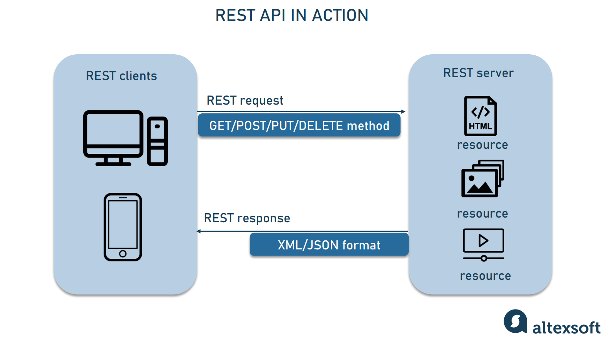
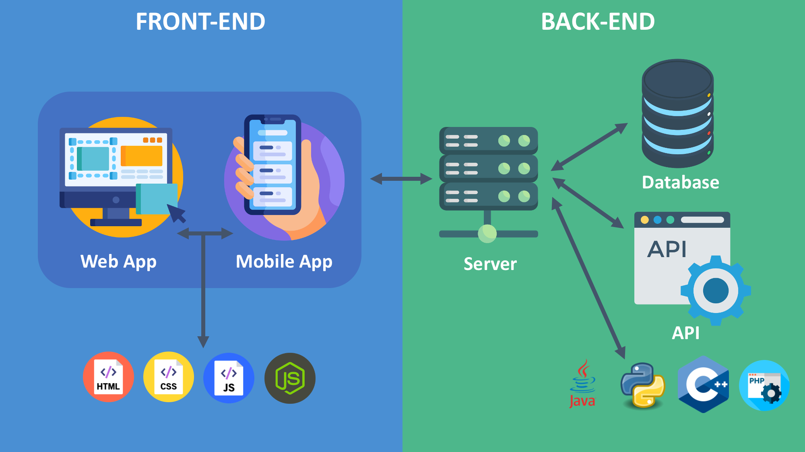

## 1️⃣ What is an API?

An API (Application Programming Interface) is a set of rules that allows one software application to communicate with another.

👉 In simple terms:

API is a messenger that takes your request to a system and brings back the response.

Real Life Example

You → Order food

Waiter → API

Kitchen → Server

You don’t go inside the kitchen. You talk to the waiter (API).

2️⃣ Why Do We Need APIs?

As a Data Analyst / Data Scientist, APIs are important because:

Fetch live data from servers

Integrate backend with frontend

Connect services (Power BI, Tableau, Apps)

Automate data pipelines

Build ML model serving systems

## 3️⃣ Types of APIs

1. Open API (Public API)

Available to everyone

Example: Weather API

2. Internal API

Used within an organization

3. Partner API

Shared with specific partners

4. Composite API

Combines multiple APIs in one call

## 4️⃣ API Architecture Types

🔹 1. REST API (Most Common)

Uses HTTP protocol

Stateless

Uses JSON

Very popular in web applications

Example:

GET https://api.example.com/users

🔹 2. SOAP API

Uses XML

More secure

Used in banking systems

🔹 3. GraphQL

Client requests exactly the data it needs

Reduces over-fetching

Example:

{
  user(id: 1) {
    name
    email
  }
}

## 5️⃣ HTTP Methods (Very Important)

Method	Purpose

GET	Retrieve data

POST	Create data

PUT	Update data

PATCH	Partial update

DELETE	Remove data

## 6️⃣ HTTP Status Codes

| Code | Meaning      | Description                                                            |
| ---- | ------------ | ---------------------------------------------------------------------- |
| 200  | Success      | The request was successful and the server returned the requested data. |
| 201  | Created      | A new resource was successfully created (usually after POST request).  |
| 400  | Bad Request  | The request was invalid or incorrectly formatted.                      |
| 401  | Unauthorized | Authentication is required or failed.                                  |
| 403  | Forbidden    | The client does not have permission to access the resource.            |
| 404  | Not Found    | The requested resource could not be found.                             |
| 500  | Server Error | Internal server error occurred on the server side.                     |

## 7️⃣ API Request Structure

Example Request

GET /users/1 HTTP/1.1

Host: api.example.com

Authorization: Bearer <token>

**Components of API Request**

Endpoint (URL)

Method (GET, POST)

Headers

Body (optional)

## 8️⃣ JSON (Most Used Data Format)

Sample JSON Response
{
  "id": 1,
  "name": "Akshay",
  "role": "Data Analyst"
}

Why JSON?

Lightweight

Easy to parse

Human readable

9️⃣ How API Works (Step-by-Step Flow)

Client sends request

Server processes request

Database interaction

Server sends response

Client receives data

## 🔟 API Authentication

1. API Key

Simple key provided in request.

?api_key=123456

2. Bearer Token (JWT)

Authorization: Bearer eyJhbGciOiJIUzI1...

3. OAuth 2.0

Used for login via:

Google

Facebook

GitHub

1️⃣1️⃣ REST API Example using Python (requests)

Install:

pip install requests

Example:

import requests

url = "https://jsonplaceholder.typicode.com/posts/1"

response = requests.get(url)

print("Status Code:", response.status_code)

print("Response JSON:", response.json())

## 1️⃣2️⃣ Creating Your Own API using Flask

Install:

pip install flask
app.py
from flask import Flask, jsonify, request

app = Flask(__name__)

data = [
    {"id": 1, "name": "Akshay"},
    {"id": 2, "name": "Rahul"}
]

@app.route('/users', methods=['GET'])
def get_users():
    return jsonify(data)

@app.route('/users', methods=['POST'])
def add_user():
    new_user = request.json
    data.append(new_user)
    return jsonify({"message": "User added"}), 201

if __name__ == '__main__':
    app.run(debug=True)

Run:

python app.py

Open:

http://127.0.0.1:5000/users

## 1️⃣3️⃣ API Testing Tools
4
1. Postman

Most popular tool for API testing.

2. Swagger

Auto API documentation.

3. cURL

Command-line API testing.

Example:

curl https://jsonplaceholder.typicode.com/posts/1

1️⃣4️⃣ Rate Limiting

API limits the number of requests per minute.

Example:

100 requests per minute

If exceeded → 429 Too Many Requests

1️⃣5️⃣ Pagination

When API has large data:

GET /users?page=1&limit=10

1️⃣6️⃣ API Versioning

/api/v1/users

/api/v2/users

Why?

Maintain backward compatibility

1️⃣7️⃣ Best Practices

Use HTTPS

Proper status codes

Use nouns in endpoint

Keep it stateless

Proper documentation

Input validation

Error handling

1️⃣8️⃣ API vs Webhook

API	Webhook

Client requests data	Server sends data automatically

Pull mechanism	Push mechanism

1️⃣9️⃣ API in Data Science

Fetch live stock data

Deploy ML model as API

Connect Power BI to backend

Microservices architecture

Automate ETL pipelines

2️⃣0️⃣ Deploying ML Model as API (FastAPI Example)

pip install fastapi uvicorn

from fastapi import FastAPI

import joblib

app = FastAPI()

model = joblib.load("model.pkl")

@app.get("/")
def home():
    return {"message": "ML API Running"}

@app.post("/predict")
def predict(data: dict):
    prediction = model.predict([data["input"]])
    return {"prediction": prediction.tolist()}

Run:

uvicorn app:app --reload