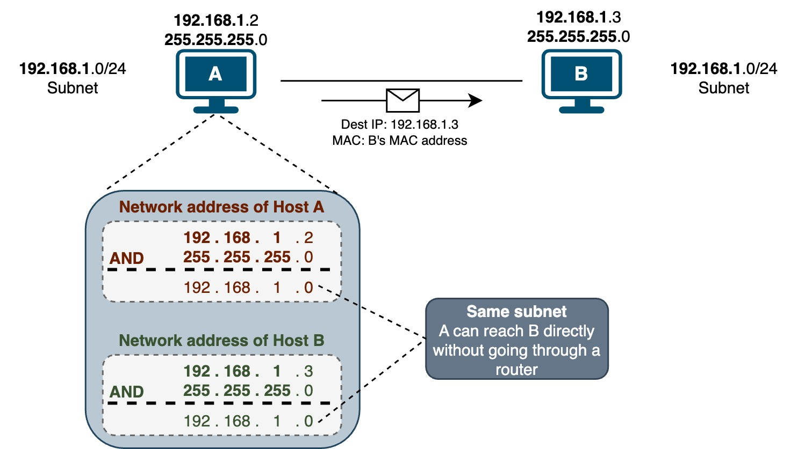
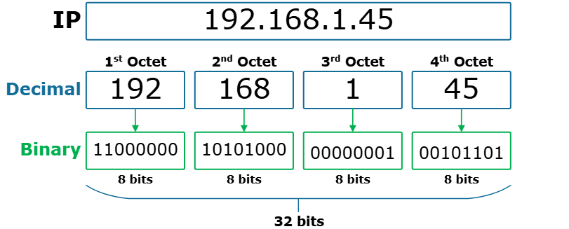

# IP Address & Ports

## 🌍 1️⃣ What is Networking?

Networking allows devices to communicate with each other over a network (LAN or Internet).

Example:

Your laptop

A cloud server (AWS/Azure)

A database server

An API server

All communicate using IP addresses and Ports.

## 🧭 2️⃣ What is an IP Address?

✅ Definition

An IP (Internet Protocol) Address is a unique identifier assigned to each device on a network.

👉 It works like a home address for your computer.

🔹 Example of IP Address

192.168.1.10

🔹 Types of IP Addresses

## 1️⃣ IPv4 (Most Common)

32-bit number

Format: x.x.x.x

Range: 0 – 255 per section

Example:

192.168.0.1

2️⃣ IPv6 (Modern Version)

128-bit number

Created due to shortage of IPv4

Much larger address space

Example:

2001:0db8:85a3:0000:0000:8a2e:0370:7334

## 🏠 3️⃣ Public vs Private IP

Type	Description	Example

Public IP	Accessible from internet	8.8.8.8

Private IP	Used inside local network	192.168.x.x

## 🔌 4️⃣ What is a Port?

✅ Definition

A Port is a logical communication endpoint on a device.

👉 IP = Building address
👉 Port = Apartment number

Without port, server doesn’t know which service to send data to.

## 🔢 Port Number Range

Range	Type

0 – 1023	Well-known ports

1024 – 49151	Registered ports

49152 – 65535	Dynamic/Private ports

🔹 Common Port Numbers

Port	Service

80	HTTP

443	HTTPS

22	SSH

21	FTP

3306	MySQL

5432	PostgreSQL

5000	Flask default

8000	FastAPI default

6667    KAFKA

## 🌐 5️⃣ IP + Port Together

When you run Flask:

python app.py

It runs at:

http://127.0.0.1:5000

Breakdown:

127.0.0.1 → IP address (localhost)

5000 → Port number

🔹 What is 127.0.0.1?

It is called:

Localhost

It means:

Your own computer

Loopback address

Used for testing

## 🔄 6️⃣ How Communication Works

Step-by-step:

Client sends request to IP + Port

Router directs traffic

Server listens on that port

Server processes request

Response sent back

## 🧠 7️⃣ What Does "Listening on a Port" Mean?

When you start a server:

app.run(port=8000)

The server is:

Listening for incoming connections on port 8000.

If no app listens on a port → connection fails.

## 🔍 8️⃣ How to Check Your IP

Windows  - ipconfig

Mac/Linux - ifconfig

## 🔥 9️⃣ Important Concepts

🔹 Open Port

If a port is open:

It accepts incoming traffic

Example:

Port 3306 open → MySQL accessible

🔹 Closed Port

No service running → connection refused.

🔹 Firewall

Controls which ports are allowed or blocked.

Example:

Cloud server allows only port 80 & 443

📊 1️⃣0️⃣ Real Example (API Deployment)

Suppose:

Server Public IP: 13.234.55.10

FastAPI running on port 8000

You access:

http://13.234.55.10:8000

If port 8000 blocked in firewall → Not accessible.

🚀 1️⃣1️⃣ Networking in Data Science

Since you're learning API & deployment, IP and ports are important for:

Deploying ML models

Hosting dashboards

Connecting Power BI to MySQL

Cloud VM setup

Docker container networking

## 🌐 IP Address Classes (IPv4)

📌 Definition

IP address classes are categories in the original IPv4 addressing system that divide IP addresses into groups based on:

Network size

Number of hosts

First octet (first number) range

This system is called Classful Addressing.

An IPv4 address is a 32-bit number, written as:

x.x.x.x

Each octet ranges from 0 to 255.

🅰️ Class A

Designed for very large networks

Uses 8 bits for network, 24 bits for hosts

First Octet Range:

1 – 126

IP Range:

1.0.0.0 – 126.255.255.255

Private Range:

10.0.0.0 – 10.255.255.255

Hosts per Network: ~16 million

🅱️ Class B

Designed for medium-sized networks

Uses 16 bits for network, 16 bits for hosts

First Octet Range:

128 – 191

IP Range:

128.0.0.0 – 191.255.255.255

Private Range:

172.16.0.0 – 172.31.255.255

Hosts per Network: ~65,000

🅲 Class C

Designed for small networks

Uses 24 bits for network, 8 bits for hosts

First Octet Range:

192 – 223

IP Range:

192.0.0.0 – 223.255.255.255

Private Range:

192.168.0.0 – 192.168.255.255

Hosts per Network: 254

🅳 Class D

Used for multicasting

Not used for assigning devices

First Octet Range:

224 – 239

IP Range:

224.0.0.0 – 239.255.255.255

🅴 Class E

Used for research and experimental purposes

Not used publicly

First Octet Range:

240 – 255

IP Range:

240.0.0.0 – 255.255.255.255

## 📌  Summary

Concept	Meaning

IP Address	Identifies device

Port	Identifies service on device

IP + Port	Identifies specific application

127.0.0.1	Local machine

Public IP	Internet accessible

Private IP	Local network only