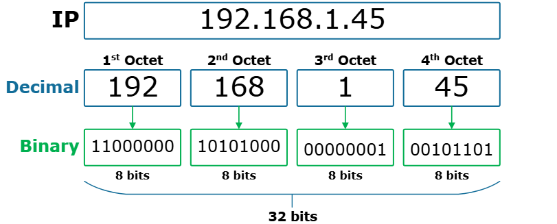
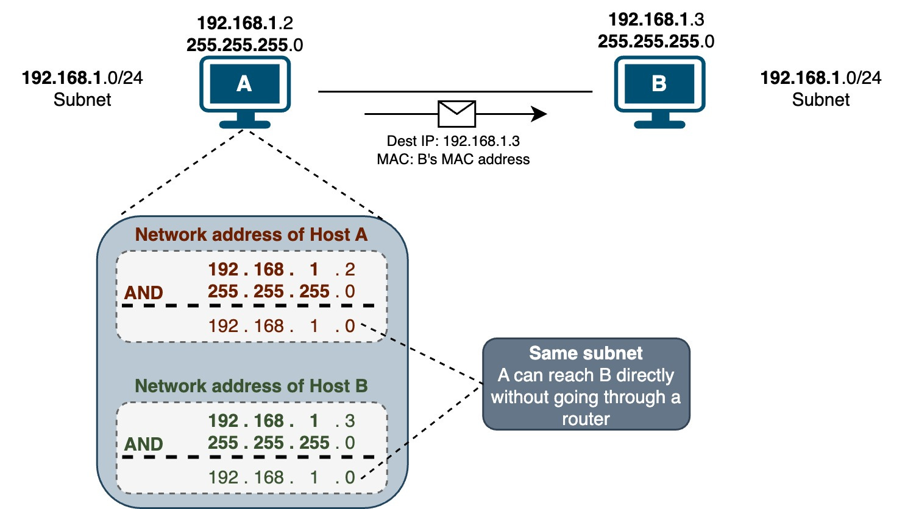

# Networking Basics for Data Engineering

Networking is how laptops, APIs, databases, cloud services, and Databricks workspaces communicate with each other.

For data engineering, networking matters when you connect to databases, call APIs, access cloud storage, deploy applications, configure firewalls, or debug connection errors.

## 1. Core Networking Flow

Most network communication follows this pattern:

```text
Client application
  -> DNS lookup
  -> IP address
  -> Port
  -> Firewall / routing / NAT
  -> Server application
  -> Response back to client
```

Example:

```text
Power BI / Databricks / Python app
  -> api.company.com
  -> 20.55.10.21
  -> port 443
  -> HTTPS API server
```

## 2. IP Address

An IP address identifies a device or service on a network.

```text
192.168.1.10
10.20.5.4
8.8.8.8
```

Think:

```text
IP address = machine address
Port       = application/service number on that machine
```

## 3. IPv4

IPv4 uses 32 bits and is written as four numbers separated by dots.

```text
192.168.1.45
```



Each section is called an octet and ranges from `0` to `255`.

## 4. IPv6

IPv6 uses 128 bits and was created because IPv4 address space is limited.

```text
2001:0db8:85a3:0000:0000:8a2e:0370:7334
```

Modern systems support IPv6, but many cloud/data projects still use IPv4, private IPv4 ranges, NAT, and private endpoints.

## 5. Public vs Private IP

| Type | Meaning | Example |
|------|---------|---------|
| Public IP | Reachable from the internet | `8.8.8.8` |
| Private IP | Used inside private networks | `10.0.0.5` |

Private IPv4 ranges:

| Range | CIDR |
|-------|------|
| `10.0.0.0` to `10.255.255.255` | `10.0.0.0/8` |
| `172.16.0.0` to `172.31.255.255` | `172.16.0.0/12` |
| `192.168.0.0` to `192.168.255.255` | `192.168.0.0/16` |

Use private IPs for internal databases, private APIs, cloud VMs, and private endpoints.

## 6. Localhost and Loopback

`127.0.0.1` means your own machine.

```text
http://127.0.0.1:8000
http://localhost:8000
```

Use localhost when testing Flask, FastAPI, Streamlit, or local APIs.

## 7. Ports

A port identifies the application running on a machine.

```text
http://127.0.0.1:8000
```

Breakdown:

```text
127.0.0.1 -> IP address
8000      -> port
```

## 8. Port Ranges

| Range | Type | Usage |
|-------|------|-------|
| `0` to `1023` | Well-known ports | Common system services |
| `1024` to `49151` | Registered ports | Application services |
| `49152` to `65535` | Dynamic/private ports | Temporary client-side ports |

Common ports:

| Port | Service |
|------|---------|
| `20`, `21` | FTP |
| `22` | SSH |
| `25` | SMTP |
| `53` | DNS |
| `80` | HTTP |
| `443` | HTTPS |
| `1433` | SQL Server |
| `3306` | MySQL |
| `5432` | PostgreSQL |
| `5672` | RabbitMQ |
| `6379` | Redis |
| `8000` | Common FastAPI dev port |
| `8080` | Common web/app dev port |
| `9092` | Apache Kafka broker default |
| `9093` | Common Kafka TLS listener / Azure Event Hubs Kafka endpoint |
| `27017` | MongoDB |

For production APIs, prefer HTTPS on port `443`.

Kafka note:

```text
Apache Kafka broker default     : 9092
Azure Event Hubs Kafka endpoint : 9093
Old HDP/Ambari Kafka setups     : sometimes 6667
```

Use the broker port given by your Kafka platform or cloud provider. Do not assume `6667` for modern Kafka projects.

## 9. Listening on a Port

A service must listen on a port before clients can connect.

```python
# FastAPI example
import uvicorn

uvicorn.run("main:app", host="0.0.0.0", port=8000)
```

Important:

```text
127.0.0.1 -> accessible only from same machine
0.0.0.0   -> listens on all network interfaces
```

If no service is listening, you usually get `connection refused`.

## 10. DNS

DNS converts a domain name into an IP address.

```text
api.company.com -> 20.55.10.21
```

Common DNS records:

| Record | Purpose |
|--------|---------|
| `A` | Domain to IPv4 address |
| `AAAA` | Domain to IPv6 address |
| `CNAME` | Alias to another domain |
| `MX` | Email server |
| `TXT` | Verification/security records |

Useful commands:

```powershell
nslookup api.company.com
Resolve-DnsName api.company.com
```

## 11. Subnet and CIDR

A subnet divides a network into smaller networks. Modern networking uses CIDR notation instead of old IP classes.

```text
192.168.1.0/24
```

Meaning:

```text
Network range : 192.168.1.0 to 192.168.1.255
Usable hosts  : usually 192.168.1.1 to 192.168.1.254
Subnet mask   : 255.255.255.0
```



Common CIDR examples:

| CIDR | Approx Addresses | Common Usage |
|------|------------------|--------------|
| `/32` | 1 | Single IP allowlist |
| `/24` | 256 | Small subnet |
| `/16` | 65,536 | Large private network |
| `/8` | 16 million+ | Very large private range |

## 12. Gateway, Router, and Routing

A gateway routes traffic from one network to another.

```text
Laptop 192.168.1.10
  -> Gateway 192.168.1.1
  -> Internet / cloud / another network
```

If two devices are in the same subnet, they can communicate directly. If they are in different subnets, traffic goes through a router.

## 13. NAT

NAT changes private IP traffic into public IP traffic when going to the internet.

```text
Private VM 10.0.1.4
  -> NAT Gateway public IP 52.10.20.30
  -> Internet API
```

Use NAT when private compute needs outbound internet access without exposing the compute directly to inbound internet traffic.

## 14. Firewall and Security Rules

A firewall controls allowed inbound and outbound traffic.

Example rule:

```text
Allow source: 10.0.0.0/16
Allow port  : 5432
Protocol    : TCP
Target      : PostgreSQL server
```

Common firewall problems:

| Error | Common Reason |
|-------|---------------|
| Connection timed out | Firewall, routing, or service unreachable |
| Connection refused | Server reachable but port not listening |
| Authentication failed | Network works, credentials/permissions wrong |
| SSL/TLS error | Certificate or protocol issue |

## 15. HTTP vs HTTPS

HTTP is unencrypted. HTTPS uses TLS encryption.

```text
http://api.company.com   -> port 80
https://api.company.com  -> port 443
```

Use HTTPS for APIs, dashboards, login pages, and production traffic.

## 16. TCP vs UDP

| Protocol | Meaning | Common Usage |
|----------|---------|--------------|
| TCP | Reliable connection-based traffic | HTTPS, SSH, databases, Kafka |
| UDP | Faster connectionless traffic | DNS, streaming, logs, telemetry |

Most data engineering systems use TCP.

## 17. VPN, VNet, VPC, and Private Endpoint

Cloud networking terms:

| Term | Meaning |
|------|---------|
| VNet | Azure private network |
| VPC | AWS/GCP private network |
| VPN | Secure tunnel between networks |
| Private Endpoint | Private IP access to a cloud service |
| Peering | Connects two private cloud networks |

Data engineering examples:

- Databricks connects privately to ADLS, S3, GCS, databases, or APIs.
- ADF connects to on-prem databases through self-hosted integration runtime.
- Power BI connects to private databases through a gateway.
- Cloud VMs access the internet using NAT gateway.

## 18. Networking in Databricks and Data Engineering

Common scenarios:

| Scenario | Networking Needed |
|----------|-------------------|
| Read from ADLS/S3/GCS | Storage endpoint access and permissions |
| Connect to SQL Server/PostgreSQL | Hostname, port, firewall, credentials |
| Call REST API | DNS, HTTPS, allowlist, proxy if required |
| Stream from Kafka/Event Hubs | Broker address, port, authentication, firewall |
| Use private endpoint | VNet/VPC routing and DNS setup |
| Access on-prem DB | VPN/ExpressRoute/Direct Connect and firewall rules |

JDBC example:

```python
jdbc_url = "jdbc:postgresql://db.company.internal:5432/sales"

df = (
    spark.read
    .format("jdbc")
    .option("url", jdbc_url)
    .option("dbtable", "public.orders")
    .option("user", dbutils.secrets.get("db-scope", "db-user"))
    .option("password", dbutils.secrets.get("db-scope", "db-password"))
    .load()
)
```

API example:

```python
import requests

response = requests.get(
    "https://api.company.com/orders",
    headers={"Authorization": f"Bearer {token}"},
    timeout=30
)

response.raise_for_status()
data = response.json()
```

## 19. Practical Troubleshooting Commands

Windows:

```powershell
ipconfig
nslookup api.company.com
Test-NetConnection api.company.com -Port 443
tracert api.company.com
netstat -ano | findstr :8000
```

Mac/Linux:

```bash
ifconfig
ip addr
nslookup api.company.com
dig api.company.com
curl -I https://api.company.com
nc -vz api.company.com 443
traceroute api.company.com
```

Databricks notebook:

```python
%sh
nslookup api.company.com
curl -I https://api.company.com
```

## 20. Common Data Engineering Connection Issues

| Problem | Check |
|---------|-------|
| Cannot connect to database | Hostname, port, firewall, VNet/VPC, credentials |
| API timeout | DNS, proxy, firewall, API allowlist, server availability |
| Storage access denied | IAM/RBAC, Unity Catalog external location, storage firewall |
| Kafka connection failed | Broker list, port `9092`, SASL/SSL config, network route |
| Works locally but not in Databricks | Databricks subnet, outbound rules, private DNS, secrets |
| Works in dev but not prod | Different firewall, DNS, private endpoint, or IAM setup |

## 21. IP Address Classes (IPv4)

IP address classes are the original IPv4 categories based on network size, host count, and first octet range.

This is called classful addressing. Modern networks use CIDR instead, but classes are still useful for interviews, old diagrams, and legacy notes.

An IPv4 address is a 32-bit number written as:

```text
x.x.x.x
```

Each octet ranges from `0` to `255`.

### 21.1 Class A

Designed for very large networks.

| Item | Value |
|------|-------|
| Network bits | 8 |
| Host bits | 24 |
| First octet range | `1` to `126` |
| IP range | `1.0.0.0` to `126.255.255.255` |
| Private range | `10.0.0.0` to `10.255.255.255` |
| Hosts per network | About 16 million |

Example:

```text
10.20.30.40
```

### 21.2 Class B

Designed for medium-sized networks.

| Item | Value |
|------|-------|
| Network bits | 16 |
| Host bits | 16 |
| First octet range | `128` to `191` |
| IP range | `128.0.0.0` to `191.255.255.255` |
| Private range | `172.16.0.0` to `172.31.255.255` |
| Hosts per network | About 65,000 |

Example:

```text
172.16.5.20
```

### 21.3 Class C

Designed for small networks.

| Item | Value |
|------|-------|
| Network bits | 24 |
| Host bits | 8 |
| First octet range | `192` to `223` |
| IP range | `192.0.0.0` to `223.255.255.255` |
| Private range | `192.168.0.0` to `192.168.255.255` |
| Hosts per network | 254 usable hosts |

Example:

```text
192.168.1.10
```

### 21.4 Class D

Used for multicasting, not for normal device assignment.

| Item | Value |
|------|-------|
| First octet range | `224` to `239` |
| IP range | `224.0.0.0` to `239.255.255.255` |
| Common use | Multicast traffic |

### 21.5 Class E

Reserved for experimental and research use.

| Item | Value |
|------|-------|
| First octet range | `240` to `255` |
| IP range | `240.0.0.0` to `255.255.255.255` |
| Common use | Reserved / experimental |

### 21.6 Modern Practical Note

In real cloud projects, use CIDR blocks instead of old class rules.

```text
VNet/VPC CIDR : 10.0.0.0/16
Subnet CIDR   : 10.0.1.0/24
Single IP     : 10.0.1.25/32
```

For data engineering, CIDR is used in firewall rules, database allowlists, private endpoints, route tables, and cloud network design.

## 22. Quick Summary

| Concept | Meaning |
|---------|---------|
| IP address | Identifies a device or service |
| Port | Identifies an application on that device |
| DNS | Converts domain name to IP address |
| CIDR | Defines network range, such as `/24` |
| Subnet | Smaller network inside a larger network |
| Gateway | Sends traffic outside the subnet |
| NAT | Allows private systems to access internet |
| Firewall | Allows or blocks traffic |
| HTTPS | Secure web/API traffic |
| Private endpoint | Private cloud access to managed services |

## 23. References

- IANA Service Name and Transport Protocol Port Number Registry: [iana.org](https://www.iana.org/assignments/service-names-port-numbers/service-names-port-numbers.xhtml)
- IANA Private-use IP Addresses: [iana.org](https://www.iana.org/help/private-addresses)
- RFC 1918 Private IPv4 Address Space: [rfc-editor.org](https://www.rfc-editor.org/rfc/rfc1918)
- RFC 4632 Classless Inter-domain Routing: [rfc-editor.org](https://www.rfc-editor.org/rfc/rfc4632)
- RFC 8200 IPv6 Specification: [rfc-editor.org](https://www.rfc-editor.org/rfc/rfc8200)
- Confluent Platform ports: [docs.confluent.io](https://docs.confluent.io/platform/current/installation/system-requirements.html)
- Azure Event Hubs ports: [learn.microsoft.com](https://learn.microsoft.com/en-us/azure/event-hubs/troubleshooting-guide)
