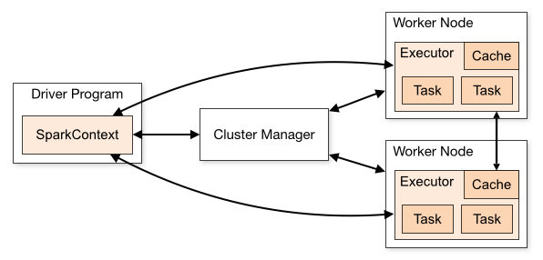

# **PySpark Overview**

 Apache Spark is an open-source analytical processing engine for large-scale, powerful distributed data processing and machine learning applications. Spark was originally developed at the University of California, Berkeley, and later donated to the Apache Software Foundation. In February 2014, Spark became a Top-Level Apache Project and has been contributed to by thousands of engineers, making Spark one of the most active open-source projects in Apache.

Apache Spark 4.0 is a framework that is supported in Scala, Python, R, and Java. 

**Below are different implementations of Spark:**

Spark – Default interface for Scala and Java

PySpark – Python interface for Spark

SparklyR – R interface for Spark.

> It process data in memory(RAM) which makes it 100 times faster than traditional Hadoop Map Reduce.

## Spark Components 

1.Low level API - RDD and Distributed variables

2.Structured API - DataFrames, Datasets and SQL

3.Libraries and ecosystem, Stuctured streaming and Advanced Analytcs

## Apache Spark Architecture

