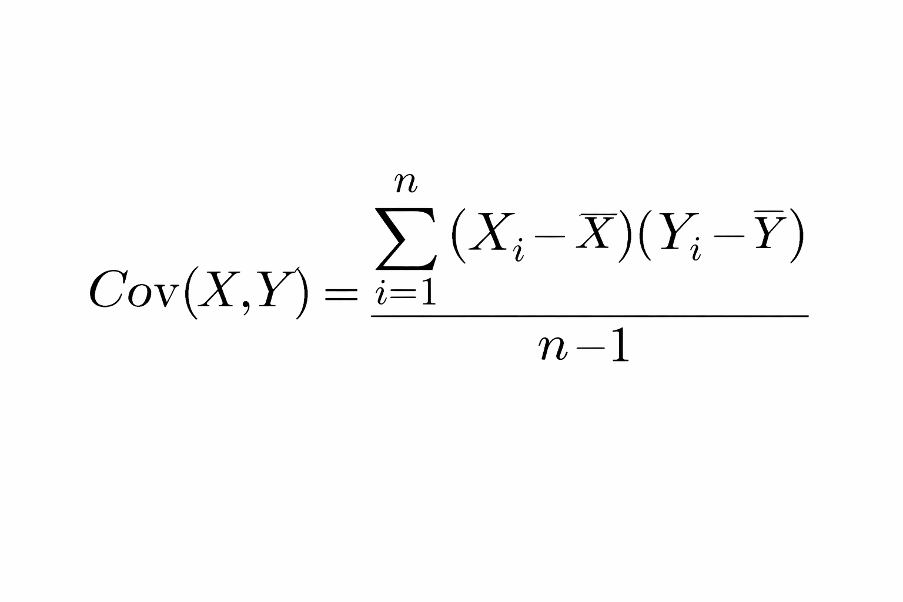
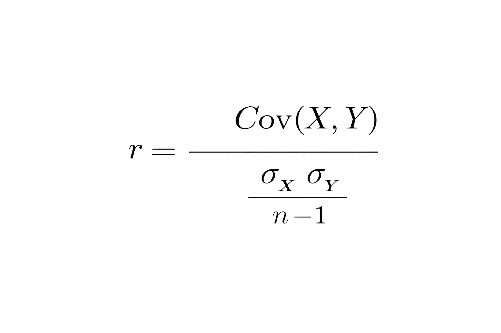

Machine Learning is a subset of AI where systems learn patterns from data instead of being explicitly programmed.

Definition:

ML is a method of data analysis that automates analytical model building using algorithms that learn from data.


Field of study that gives computers the ability to learn without being explicitly programmed.

A computer program is said to learn from experience E with respect to some task T and some performance measure P, if its performance on T, as measured by P, improves with experience E.


## Artificial Intelligence (AI)

Artificial Intelligence (AI) is the broader field of building systems that can perform tasks that normally require human intelligence.

Examples:

Speech recognition

Image recognition

Decision-making systems

Self-driving cars


## Types of Machine Learning

**Supervised Learning**

Data is labeled

Has input (X) and output (Y)

Examples:

Linear Regression

Logistic Regression

Decision Trees

**Unsupervised Learning**

No labeled output

Only input data

Examples:

K-Means Clustering

Hierarchical Clustering

PCA

## Supervised Learning → Regression

Regression is used when:

✅ Target variable is numeric

Example:

Insurance premium

Sales

Returns

Temperature

## Business Problem

Problem: Predict vehicle insurance premium.

Target variable:

Insurance Premium (Y)

Independent variables:

Age, Mileage, Engine Capacity, Condition, Manufacturer

## Basic Terminology

Dependent Variable (Target Variable)

Variable to be predicted

Denoted by Y

Example:

Insurance Premium

Independent Variable (Predictor Variable)

Variables used to predict Y

Denoted by X

Example:

Mileage, Age, Engine Capacity

## Statistical Basics

**Covariance**

Measures how two variables move together.

Covariance is a measure of how changes in one variable are associated with changes in another variable.

Formula:



Interpretation:

Positive → Move together

Negative → Move opposite

Zero → No linear relationship

**Pearson Correlation Coefficient**

Scaled version of covariance.



Range: -1 ≤ r ≤ 1


+1	: Perfect positive

-1	: Perfect negative

0	: No linear relationship

## Regression Analysis

Definition:

Regression analysis studies the relationship between dependent and independent variables.

Purpose:

Identify important predictors

Quantify impact

Predict values

## Types of Association

```
Association
│
├── Linear
├── Non-Linear
└── No Relationship
```

## Simple Linear Regression (SLR)

Used when:

One independent variable

Linear relationship

Model Equation

Premium = β0 ​+ β1 ​(Mileage) + ε

## Error Term (Residual)

Error Term    

ε = Y actual ​− Y predicted​

Squared Error

ε2 = (Y actual ​− Y predicted​ ) **2

Sum of Squared Errors

SSE = ∑ε**2

## Ordinary Least Squares (OLS)

The OLS method aims to minimize the sum of the squared difference between the actual and predicted values.

Error Function

E = ∑ ( Y − ( β0​ + β1​X ) )**2

> Durbin-Watson test - It is used to check autocorrelation

        Test statistic is near to 2 : No correlation

                        b/w 0 and 2 : Positive correlation

                        2 and 4     : negative correlation

> Jarque-Bera test - It is used to check normality of residuals
        
        Using P-value - P < 0.05 - Not normal

> Condition Number - Used to check the multicollinearity 

        If CN < 100 : No multicollinearit

        If CN b/w 100 and 200 : Moderate multicollinearit

        If CN >1000 : Severe multicollinearit

**✅ Multicollinearity**

Multicollinearity occurs when independent variables are highly correlated with each other.

It makes coefficient estimates unstable and reduces the reliability of interpreting individual predictor effects.

**✅ Autocorrelation**

Autocorrelation occurs when error terms are correlated with each other, usually across time.

It violates the independence assumption of regression and can lead to misleading statistical results.

**✅ Variance Inflation Factor (VIF)**

VIF (Variance Inflation Factor) measures how much the variance of a regression coefficient is inflated due to multicollinearity.

It is used to detect the presence of Multicollinearity

VIF = 1/(1-R-Square)

VIF > 5  : High correlation

VIF b/w 1 to 5 : Moderate correlation       

VIF = 1 : No correlation

## Estimated Model

Premium=327.0860−11.6905×Mileage

Interpretation

$\beta_0 = 327.086$ → Premium when mileage = 0

$\beta_1 = -11.6905$ → Premium decreases by 11.69 per unit increase in mileage

## Measures of Variation

Total Sum of Squares (SST)

SST = ∑ (Yi ​− Yˉ )**2

Sum of Squares Regression (SSR)

SSR = ∑ ( Y^i ​− Yˉ )**2

Sum of Squares Error (SSE)

SSE = ∑ ( Yi ​− Y^i ​)**2

    > SST = SSR + SSE

## R-Squared (Coefficient of Determination)

The coefficient of determination explains the percentage of variation in the dependent variable that the independent variables explains collectively.

R2 = SST / SSR  

OR

R2 = 1 − SST / SSE​​

In python : r_sq = SLR_model.rsquared

Range : 0 ≤ R 2 ≤ 1

**Limitations of R2**

Always increases when new predictors are added

Can lead to overfitting

## Adjusted R²

Adjusted R² measures the proportion of variance explained by the model, adjusted for the number of predictors used.

Unlike R², it only increases if a new variable improves the model significantly, helping prevent overfitting.

R2 adj = 1 - ( SSE / ( n − k − 1 ) / SST / ( n - 1 ) )

n = sample size

k = number of predictors

## Assumptions of Linear Regression

**Before building model:**

Target must be numeric

No multicollinearity

**After building model:**

Linear relationship

Homoscedasticity

No autocorrelation

Errors normally distributed


🔹 Major Python Libraries

import numpy as np

import pandas as pd

import matplotlib.pyplot as plt

import seaborn as sns

from sklearn.linear_model import LinearRegression

from sklearn.metrics import r2_score, mean_squared_error

🔹 Simple Linear Regression Code

from sklearn.linear_model import LinearRegression

X = df[['Mileage']]

y = df['Premium']

model = LinearRegression()

model.fit(X, y)

print("Intercept:", model.intercept_)

print("Slope:", model.coef_)

🔹 Multiple Linear Regression Code

X = df[['Mileage', 'Engine_Capacity', 'Age']]

y = df['Premium']

model = LinearRegression()

model.fit(X, y)

print("Intercept:", model.intercept_)

print("Coefficients:", model.coef_)

1️⃣ Feature

Definition

A feature (or attribute) is an independent variable that acts as input to a model.

Dataset columns (except target) are called features.

Target variable is the dependent variable.

Example:


Product ID, Store, City → Features

2️⃣ Feature Extraction

Feature Extraction includes:

Feature Transformation

Feature Engineering

Feature Selection

3️⃣ Feature Transformation

Definition

Feature transformation means replacing an existing feature with a mathematical function of that feature.

Example:

X → log(X)

X → √X

X → 1/X

Why Do We Need Feature Transformation?

To reduce skewness

To satisfy assumptions of Linear Regression

To linearize non-linear relationships

To make data approximately normally distributed

Important Rule ⚠️

Model comparison should always be done using the original target variable scale, not the transformed scale.

4️⃣ Assumption of Normality

Parametric methods assume:

Data follows a normal distribution

Sample statistics represent population properly

Therefore:

It is preferable for features to be approximately normally distributed.

5️⃣ Transformation Methods

1️⃣ Logarithmic Transformation

Definition

Replace variable with natural log:

X → ln(X)

Used When:

Data is positively skewed

Relationship is multiplicative (Y = mX^k)

Cannot Be Used When:

X has zero or negative values

Dummy variables (ln(0) undefined)

2️⃣ Square Root Transformation

X → √X

Used When:

Reduce right skewness

Data contains zero values

Can handle zero, but not negative values.

3️⃣ Reciprocal Transformation

X → 1/X

Used When:

Strong right skewness

Cannot Be Used When:

X = 0

Can handle negative values.

Example:

Population density → Area per person

4️⃣ Exponential Transformation

X → exp(X)

Used to reverse logarithmic transformation.

5️⃣ Box-Cox Transformation

Generalized form of transformation:

Uses parameter λ (lambda)

Works only for positive values

λ is tuned based on data

More flexible than log transformation.

6️⃣ Feature Scaling

Definition

Feature scaling transforms features into a common scale.

Why Is It Needed?

ML algorithms use distance calculations

Features with large magnitude dominate smaller ones

Example:

Age: 18–65

Income: 10,000–1,00,000

Income will dominate without scaling.

7️⃣ Feature Scaling Methods

1️⃣ Normalization (Min-Max Scaling)

Rescales values to:

0 to 1

Formula:

X_scaled = (X - min) / (max - min)

Use When:

Distribution is unknown

Data is not Gaussian

2️⃣ Standardization (Z-score Scaling)

Rescales to:

Mean = 0

Standard deviation = 1

Formula:

X_scaled = (X - μ) / σ

Use When:

Data is approximately Gaussian

Outliers are important

Normalization vs Standardization

| Feature                     | Normalization        | Standardization        |
|----------------------------|----------------------|------------------------|
| Range                      | 0 to 1               | Mean = 0, SD = 1      |
| Sensitive to Outliers      | Yes                  | Less                  |
| Assumes Gaussian Distribution | No               | Yes (preferred)       |


8️⃣ Feature Selection

Definition

Feature selection means selecting only significant features for the model.

Methods

Forward Selection

Backward Elimination

Stepwise Regression

Recursive Feature Elimination (RFE)

9️⃣ Forward Selection

Procedure

Start with null model (no predictors)

Add most correlated variable

Check significance

Continue adding significant variables

Stop when no more improvement

🔟 Backward Elimination

Procedure

Start with full model (all predictors)

Remove variable with highest p-value

Refit model

Repeat until all variables are significant

1️⃣1️⃣ Stepwise Regression

Combination of:

Forward selection

Backward elimination

At each step:

Add or remove variable based on p-value

1️⃣2️⃣ Recursive Feature Elimination (RFE)

Procedure:

Train full model

Rank features

Remove least important feature

Refit model

Repeat

🔹 Regularization 

What is Regularization?

Regularization is a technique used to:

Prevent overfitting

Reduce model complexity

Penalize large coefficients

It adds a penalty term to the loss function.

1️⃣ Ridge Regression (L2 Regularization)

Adds penalty:

λ ∑ β 2

Key Points:

Shrinks coefficients toward zero

Does NOT make coefficients exactly zero

Keeps all features in the model

Reduces variance

When to Use:

When most features are useful

When multicollinearity exists

2️⃣ Lasso Regression (L1 Regularization)

Adds penalty:

𝜆 ∑ ∣ 𝛽 ∣ λ ∑ ∣ β ∣

Key Points:

Shrinks coefficients

Can make some coefficients exactly zero

Performs automatic feature selection

Produces sparse models

When to Use:

When many features are irrelevant

When feature selection is required

1️⃣3️⃣ Optimization

Optimization includes:

Prediction Evaluation

Model Validation

Fine Tuning

1️⃣4️⃣ Prediction Evaluation

Prediction errors depend on:

Bias

Variance

1️⃣5️⃣ Bias

Bias = Difference between predicted values and true values.

High bias:

Model too simple

Underfitting

Low variance

Example:

Straight line fitting curved data

1️⃣6️⃣ Variance

Variance = Model sensitivity to training data.

High variance:

Model too complex

Overfitting

Low bias

Example:

Curve perfectly fitting training data but poor test performance

1️⃣7️⃣ Bias-Variance Tradeoff

| Model Type | Bias | Variance | Problem        |
|------------|------|----------|---------------|
| Simple     | High | Low      | Underfitting  |
| Complex    | Low  | High     | Overfitting   |

Goal:

Find balance between bias and variance.

1️⃣8️⃣ Model Validation

Used to validate model performance on unseen data.

Cross Validation Methods

Two-Fold Cross Validation

K-Fold Cross Validation

LOOCV

1️⃣9️⃣ Two-Fold Cross Validation

Split data into 2 equal parts

Train on one, test on other

Swap

Sum errors

2️⃣0️⃣ K-Fold Cross Validation

Procedure:

Split dataset into k subsets

Use one subset as test

Train on remaining k-1

Repeat k times

Average error

Common choice:

k = 5 or 10

2️⃣1️⃣ LOOCV (Leave One Out Cross Validation)

Special case of k-fold:

k = n (number of observations)

One observation used as test each time

n runs

Disadvantage:

High variance

## Train-Test Split Ratio

Train-test split is used to evaluate model performance on unseen data.

| Training Data | Testing Data | When to Use          |
|---------------|-------------|----------------------|
| 80%           | 20%         | Large datasets       |
| 70%           | 30%         | Medium datasets      |
| 90%           | 10%         | Very large datasets  |

🔹 Evaluation Metrics (Regression)

Used to measure prediction error.

1️⃣ MSE (Mean Squared Error)

MSE=n1​∑(y−y^​)2

Penalizes large errors heavily

Lower is better

2️⃣ RMSE (Root Mean Squared Error)

RMSE = square root (MSE)


Same unit as target variable

Easier to interpret than MSE

Lower is better

3️⃣ MAE (Mean Absolute Error)

MAE=n1​∑∣y−y^​∣

Less sensitive to outliers

Measures average absolute error

Lower is better

4️⃣ R² (R-Squared)

R2= 1 − (SS_res/SS_tot)​

Where:

SS_res = Sum of squared residuals

SS_tot = Total sum of squares

Interpretation:

0 → Model explains nothing

1 → Perfect model

Can be negative if model performs worse than mean

1️⃣ Gradient Descent

What is Gradient Descent?

Gradient Descent is an optimization technique used to:

Minimize the cost function

Find optimal model parameters

Iteratively update parameters

It takes:

Large steps when far from optimum

Small steps near optimum

2️⃣ Cost Function

What is a Cost Function?

A cost function measures how well the model performs.

For Linear Regression:

Cost Function (J) = Σ (y_actual - y_predicted)^2

Also called:

Loss Function

Error Function

Goal:

Minimize this value.

3️⃣ Gradient Descent Update Rule

Parameter update rule:

New Parameter = Old Parameter - (Learning Rate × Derivative of Cost Function)

Where:

Learning Rate = α

Derivative = slope of cost function

4️⃣ Learning Rate (α)

Definition

Learning rate (α) is a hyperparameter that controls step size.


## Effect of Learning Rate

| Learning Rate | Effect                         |
|---------------|--------------------------------|
| Very High     | May skip optimal solution      |
| Very Low      | Very slow convergence          |
| Proper Value  | Fast and stable convergence    |


5️⃣ Gradient Descent Procedure

1. Initialize parameters (β0, β1, ...)

2. Compute cost function

3. Compute derivative

4. Update parameters

5. Repeat until convergence

Convergence occurs when derivative ≈ 0.

6️⃣ Types of Gradient Descent

1️⃣ Batch Gradient Descent

Uses entire dataset

Stable convergence

Computationally expensive

2️⃣ Stochastic Gradient Descent (SGD)

Uses one sample at a time

Faster for large datasets

Noisy updates

Works well for large-scale data

3️⃣ Mini-Batch Gradient Descent

Uses small group of samples

Combination of Batch & SGD

Faster and stable

Comparison Table

| Type | Data Used per Update | Speed | Stability |
|------|---------------------|--------|-----------|
| Batch GD | Entire dataset | Slow | Very Stable |
| SGD | One sample | Very Fast | Noisy |
| Mini-Batch GD | Small batch | Fast | Balanced |

7️⃣ Underfitting & Overfitting

Underfitting

Model too simple

High Bias

Low Variance

Overfitting

Model too complex

Low Bias

High Variance

Poor generalization

8️⃣ Generalization Error

If:

Training error low

Test error high

→ Model is overfitting

Goal:

Minimize generalization error.

9️⃣ Regularization

What is Regularization?

Regularization reduces overfitting by:

Adding penalty to cost function

Shrinking coefficients

Controlling model complexity

Regularized Loss Function

Loss_regularized = OLS Loss + Penalty Term

🔟 Regularization Parameter (λ)

λ controls strength of penalty.

λ Value	Effect

0	No regularization

Small	Slight shrinkage

Large	Strong shrinkage

Best λ is chosen using cross-validation.

1️⃣1️⃣ Types of Regularization

1️⃣ Ridge Regression (L2 Regularization)

Penalty:

Penalty = λ Σ (β^2)

Properties:

Shrinks coefficients

Does NOT make them zero

Reduces variance

2️⃣ Lasso Regression (L1 Regularization)

Penalty:

Penalty = λ Σ |β|

Properties:

Shrinks coefficients

Can make coefficients exactly zero

Performs feature selection

3️⃣ Elastic Net Regression

Combination of Ridge + Lasso

Loss = Σ(y - y_pred)^2 

       + λ_ridge Σ(β^2) 

       + λ_lasso Σ|β|

1️⃣2️⃣ Ridge vs Lasso vs Elastic Net

| Method | Penalty Type | Can Make Coefficient Zero? | Use Case |
|--------|-------------|---------------------------|----------|
| Ridge | L2 | No | When all features important |
| Lasso | L1 | Yes | When feature selection needed |
| Elastic Net | L1 + L2 | Yes | When many correlated features |

1️⃣3️⃣ Feature Scaling Before Regularization

Regularization penalizes large coefficients.

Therefore:

Features must be scaled before applying regularization.

If data is not Gaussian → Use Min-Max Scaling

If Gaussian → Use Standardization

1️⃣4️⃣ RMSE Comparison (Example from Slides)

| Model | Train RMSE | Test RMSE | Conclusion |
|--------|------------|-----------|------------|
| Least Squares | 0.2315 | 0.3139 | Overfitting |
| Lasso | 0.2776 | 0.2754 | Better Generalization |
| Elastic Net | 0.2776 | 0.2754 | Better Generalization |

1️⃣5️⃣ When to Use Which Regularization?

Use Ridge → When all predictors important

Use Lasso → When useless predictors exist

Use Elastic Net → When many predictors & correlation exists

1️⃣6️⃣ Occam’s Razor

When faced with two equally good hypotheses, choose the simpler one.

Regularization follows this principle.

1️⃣7️⃣ Hyperparameters

What is a Hyperparameter?

A parameter set manually before training.

Examples:

Learning rate (α)

Regularization parameter (λ)

1️⃣8️⃣ Grid Search

What is Grid Search?

Grid Search is used to:

Tune hyperparameters

Try multiple combinations

Select best performing pair

Grid Search Procedure

1. Define range of hyperparameters

2. Create grid of combinations

3. Perform k-fold cross validation

4. Compute performance metric

5. Select combination with best performance

Example

If:

λ = [0.1, 0.5, 1.0]

α = [0.01, 0.1, 0.5]

GridSearch tries all combinations and selects best.


📌 Summary Flow

```
AI
 └── ML
      ├── Supervised
      │      ├── Regression
      │      │      ├── Simple Linear Regression
      │      │      └── Multiple Linear Regression
      │      └── Classification
      └── Unsupervised
```